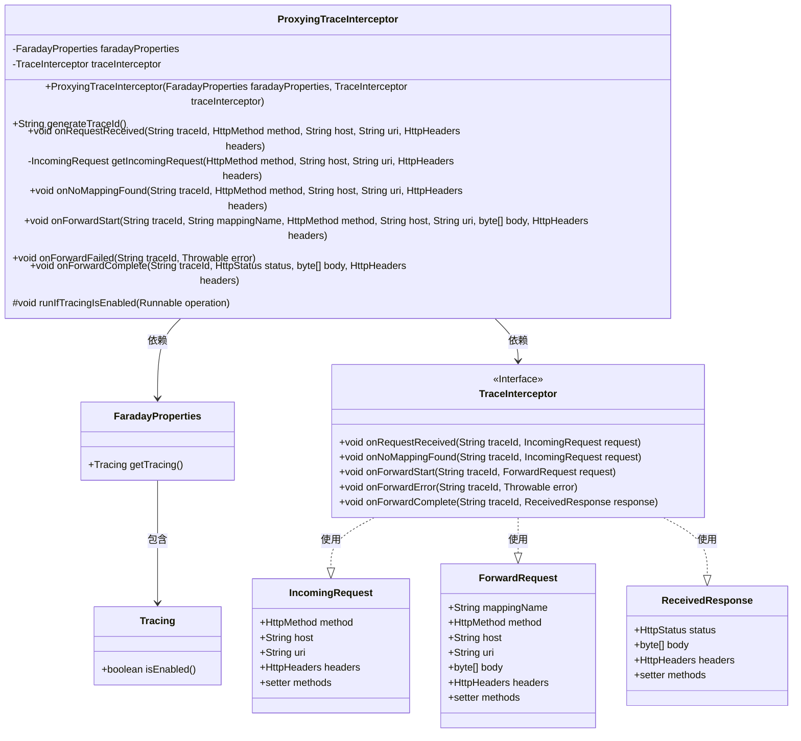
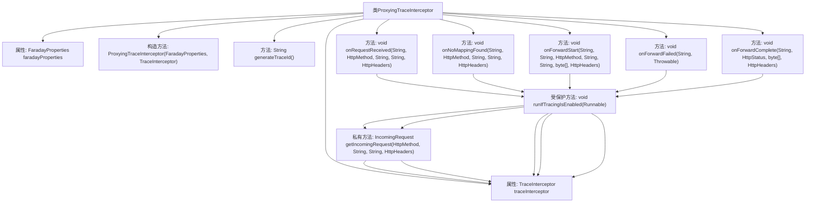

# 基础信息

|      |      |
|------|------|
| 名称 | ProxyingTraceInterceptor |
| 编码语言 | .java |
| 代码路径 | staffjoy/faraday/src/main/java/xyz/staffjoy/faraday/core/trace/ProxyingTraceInterceptor.java |
| 包名 | xyz.staffjoy.faraday.core.trace |
| 依赖项 | ['org.springframework.http.HttpHeaders', 'org.springframework.http.HttpMethod', 'org.springframework.http.HttpStatus', 'xyz.staffjoy.faraday.config.FaradayProperties', 'java.util.UUID.randomUUID'] |
| 概述说明 | 代理追踪拦截器类，处理请求转发前后的追踪逻辑，包括生成ID、记录事件及错误。 |

# 说明

ProxyingTraceInterceptor是一个用于处理请求追踪的类，包含FaradayProperties和TraceInterceptor依赖。主要功能包括生成追踪ID，处理请求接收、无映射发现、转发开始、转发失败和转发完成等事件。通过runIfTracingIsEnabled方法确保仅在追踪启用时执行操作。类中封装了IncomingRequest、ForwardRequest和ReceivedResponse等对象，用于传递请求和响应信息。所有操作都委托给traceInterceptor处理。

# 类列表 Class Summary

| 名称   | 类型  | 说明 |
|-------|------|-------------|
| ProxyingTraceInterceptor | class | 代理跟踪拦截器类，处理请求转发前后的跟踪事件，包括生成跟踪ID、请求接收、转发开始/完成/失败等操作。 |

## 类 ProxyingTraceInterceptor

|      |      |
|------|------|
| 访问范围 | public |
| 类型 | class |
| 名称 | ProxyingTraceInterceptor |
| 说明 | 代理跟踪拦截器类，处理请求转发前后的跟踪事件，包括生成跟踪ID、请求接收、转发开始/完成/失败等操作。 |

### UML类图

这段代码展示了一个代理跟踪拦截器系统，ProxyingTraceInterceptor作为核心类，通过FaradayProperties控制跟踪功能开关，并委托TraceInterceptor接口实现具体跟踪操作。类图清晰地呈现了跟踪请求/响应的数据结构（IncomingRequest/ForwardRequest/ReceivedResponse）和层级关系，其中TraceInterceptor作为接口定义了完整的跟踪生命周期方法，而FaradayProperties通过嵌套的Tracing类提供配置支持。整个设计采用策略模式，通过运行时判断跟踪是否启用来决定是否执行跟踪操作。

### 内部方法调用关系图

这段代码展示了一个代理跟踪拦截器类，主要用于处理HTTP请求的跟踪逻辑。核心功能包括：生成跟踪ID、处理请求接收/转发事件、错误处理和响应完成事件。所有操作都通过runIfTracingIsEnabled方法进行追踪开关检查，确保仅在追踪启用时执行。类通过组合FaradayProperties和TraceInterceptor来实现配置管理和实际跟踪功能，体现了良好的职责分离设计。

### 字段列表 Field List

| 名称  | 类型  | 说明 |
|-------|-------|------|
| traceInterceptor | TraceInterceptor | 受保护的最终追踪拦截器实例。 |
| faradayProperties | FaradayProperties | 保护型FaradayProperties属性 |

### 方法列表 Method List

| 名称  | 类型  | 说明 |
|-------|-------|------|
| generateTraceId | String | 生成追踪ID，若启用则返回随机UUID，否则返回空。 |
| getIncomingRequest | IncomingRequest | 创建IncomingRequest对象，设置方法、主机、URI和头部后返回。 |
| runIfTracingIsEnabled | void | 条件执行：若追踪启用则运行操作。 |
| onForwardStart | void | 方法在跟踪启用时创建转发请求并调用拦截器。 |
| onNoMappingFound | void | 方法处理未找到映射请求，记录跟踪ID和请求信息。 |
| onForwardFailed | void | 跟踪失败时调用错误处理函数。 |
| onRequestReceived | void | 接收请求时启用追踪，记录方法、主机、URI和头信息。 |
| onForwardComplete | void | 方法onForwardComplete在跟踪启用时记录响应状态、体和头信息。 |

