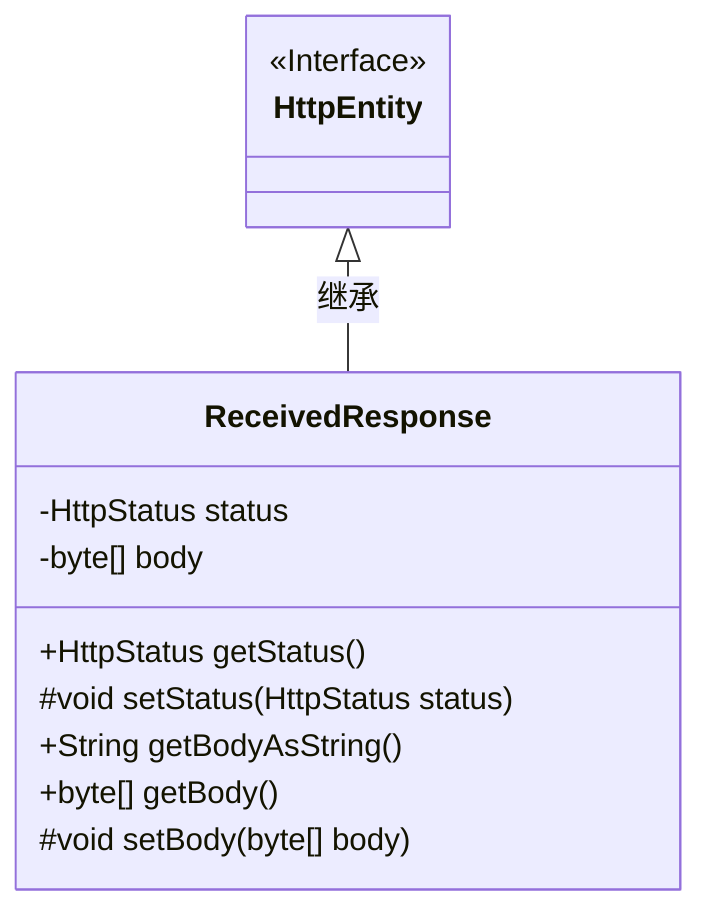
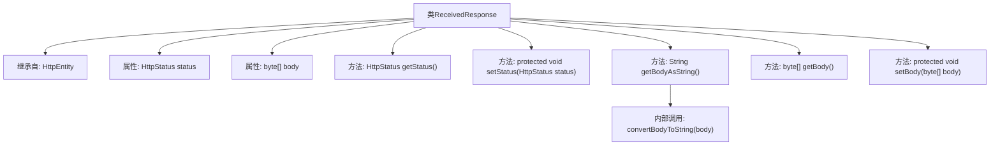

# 基础信息

|      |      |
|------|------|
| 名称 | ReceivedResponse |
| 编码语言 | .java |
| 代码路径 | staffjoy/faraday/src/main/java/xyz/staffjoy/faraday/core/trace/ReceivedResponse.java |
| 包名 | xyz.staffjoy.faraday.core.trace |
| 依赖项 | ['org.springframework.http.HttpStatus', 'xyz.staffjoy.faraday.core.utils.BodyConverter.convertBodyToString'] |
| 概述说明 | 接收响应类，含状态码和字节数组体，提供获取状态、字符串体和字节体的方法。 |

# 说明

这是一个名为ReceivedResponse的Java类，继承自HttpEntity类。该类包含两个主要属性：status表示HTTP状态码，类型为HttpStatus；body表示响应体，类型为字节数组。提供了获取和设置status的方法getStatus和setStatus，其中setStatus是受保护的。提供了获取body的方法getBody和设置body的受保护方法setBody。还提供了一个便捷方法getBodyAsString，用于将字节数组形式的body转换为字符串。所有方法都围绕HTTP响应的状态和内容进行操作。

# 类列表 Class Summary

| 名称   | 类型  | 说明 |
|-------|------|-------------|
| ReceivedResponse | class | ReceivedResponse类继承HttpEntity，包含状态码和响应体，提供获取和设置方法。 |

## 类 ReceivedResponse

|      |      |
|------|------|
| 访问范围 | public |
| 类型 | class |
| 名称 | ReceivedResponse |
| 说明 | ReceivedResponse类继承HttpEntity，包含状态码和响应体，提供获取和设置方法。 |

### UML类图

这段类图展示了ReceivedResponse类继承自HttpEntity接口的结构。ReceivedResponse包含两个私有字段(status和body)，提供了获取HTTP状态码和响应体的公有方法(getStatus/getBody)，以及受保护的状态和响应体设置方法(setStatus/setBody)。特别值得注意的是getBodyAsString()方法，它通过内部转换将字节数组形式的响应体转为字符串。类图中清晰体现了继承关系和访问控制权限，其中HttpEntity作为父接口用<<Interface>>标记，子类实现了基本的HTTP响应处理功能。

### 内部方法调用关系图

这段流程图描述了ReceivedResponse类的结构，该类继承自HttpEntity，包含两个核心属性(status和body)及五个方法。其中getBodyAsString()方法内部调用了convertBodyToString()进行字节数组到字符串的转换，setStatus()和setBody()被设计为protected方法以实现受控的状态修改。整体展现了HTTP响应体的封装逻辑和访问控制机制。

### 字段列表 Field List

| 名称  | 类型  | 说明 |
|-------|-------|------|
| body | byte[] | 声明受保护的字节数组body。 |
| status | HttpStatus | 声明受保护的HttpStatus状态变量。 |

### 方法列表 Method List

| 名称  | 类型  | 说明 |
|-------|-------|------|
| getBodyAsString | String | 方法返回请求体字符串。 |
| getStatus | HttpStatus | 获取HTTP状态码的方法。 |
| setStatus | void | 设置HTTP状态码的方法。 |
| getBody | byte[] | 获取字节数组body的方法。 |
| setBody | void | 设置字节数组类型的body属性值。 |

