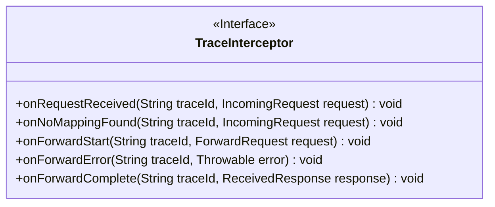
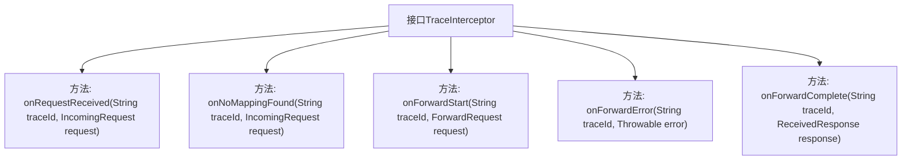

# 基础信息

|      |      |
|------|------|
| 名称 | TraceInterceptor |
| 编码语言 | .java |
| 代码路径 | staffjoy/faraday/src/main/java/xyz/staffjoy/faraday/core/trace/TraceInterceptor.java |
| 包名 | xyz.staffjoy.faraday.core.trace |
| 依赖项 | [] |
| 概述说明 | 追踪拦截器接口，处理请求接收、无映射、转发开始、错误及完成事件。 |

# 说明

TraceInterceptor是一个接口，定义了五个关键方法用于跟踪请求处理过程。onRequestReceived在收到请求时触发，参数包括追踪ID和请求对象。onNoMappingFound在没有找到映射时调用，参数与前者相同。onForwardStart在转发请求开始时触发，参数为追踪ID和转发请求对象。onForwardError在转发出错时调用，参数为追踪ID和异常对象。onForwardComplete在转发完成时触发，参数为追踪ID和接收到的响应对象。该接口完整覆盖了请求处理的生命周期事件。

# 类列表 Class Summary

| 名称   | 类型  | 说明 |
|-------|------|-------------|
| TraceInterceptor | interface | 追踪拦截器接口：处理请求接收、无映射、转发开始、错误及完成事件。 |

## 类 TraceInterceptor

|      |      |
|------|------|
| 访问范围 | public |
| 类型 | interface |
| 名称 | TraceInterceptor |
| 说明 | 追踪拦截器接口：处理请求接收、无映射、转发开始、错误及完成事件。 |

### UML类图

该类图展示了一个名为`TraceInterceptor`的接口，定义了五个核心方法用于处理请求追踪的不同阶段：接收请求、无映射时、转发开始、转发错误和转发完成。每个方法都接收`traceId`作为追踪标识，并根据不同阶段处理相应类型的参数（如`IncomingRequest`、`ForwardRequest`等）。接口设计适用于分布式系统中的请求链路监控场景，通过标准化回调方法实现全链路事件捕获。

### 内部方法调用关系图

该流程图展示了TraceInterceptor接口的五个核心方法，这些方法定义了请求追踪的不同阶段处理逻辑。从接收请求(onRequestReceived)、无映射处理(onNoMappingFound)、转发开始(onForwardStart)，到转发异常(onForwardError)和完成(onForwardComplete)，构成了完整的请求生命周期监控体系。每个方法都接收traceId作为追踪标识，并处理不同类型的参数对象。

### 字段列表 Field List

| 名称  | 类型  | 说明 |
|-------|-------|------|

### 方法列表 Method List

| 名称  | 类型  | 说明 |
|-------|-------|------|
| onRequestReceived | void | 接收请求并处理，参数为追踪ID和请求对象。 |
| onNoMappingFound | void | 未找到映射时处理跟踪ID和请求的方法。 |
| onForwardError | void | 记录错误及追踪ID的方法。 |
| onForwardStart | void | 方法：开始转发请求，参数为追踪ID和请求对象。 |
| onForwardComplete | void | 回调函数，处理完成响应和跟踪ID。 |

