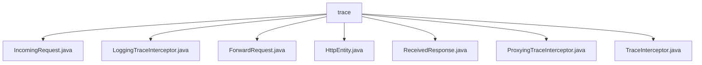

# 基础信息

|      |      |
|------|------|
| 名称 | trace |
| 编码语言 | .java |
| 代码路径 | staffjoy/faraday/src/main/java/xyz/staffjoy/faraday/core/trace |
| 包名 | staffjoy.docs.faraday.src.main.java.xyz.staffjoy.faraday.core.trace |
| 概述说明 | HTTP请求处理类集合：IncomingRequest封装请求信息，LoggingTraceInterceptor记录日志，ForwardRequest处理转发，HttpEntity管理头信息，ReceivedResponse处理响应，ProxyingTraceInterceptor协调追踪，TraceInterceptor定义生命周期接口。 |

# 说明

## 概述

该代码模块是一个HTTP请求追踪系统，主要用于记录和监控HTTP请求的处理过程。模块包含多个核心类，共同实现了请求信息的封装、转发过程的跟踪以及日志记录功能。主要特点包括：

1. 提供了完整的HTTP请求/响应信息封装（IncomingRequest、ForwardRequest、ReceivedResponse）
2. 实现了请求处理生命周期的跟踪机制（TraceInterceptor接口及其实现）
3. 支持可配置的追踪功能（ProxyingTraceInterceptor）
4. 提供了详细的日志记录功能（LoggingTraceInterceptor）

## 主要业务场景

该模块主要应用于以下业务场景：

1. **HTTP请求跟踪与监控**：
   - 记录接收到的HTTP请求详细信息（方法、URI、主机、头信息等）
   - 跟踪请求转发过程（转发开始、转发完成或转发失败）
   - 监控请求处理状态（状态码、响应体等）

2. **请求转发代理**：
   - 处理请求映射关系（mappingName）
   - 管理请求转发过程中的数据转换（字节数组与字符串互转）
   - 处理转发失败情况并记录错误信息

3. **调试与问题排查**：
   - 通过日志记录完整的请求处理链路
   - 提供详细的错误信息记录
   - 支持请求/响应内容的可读性转换（如字节数组转字符串）

4. **可扩展的追踪系统**：
   - 通过TraceInterceptor接口支持自定义的追踪实现
   - 可灵活配置是否启用追踪功能
   - 支持在不同的处理阶段插入自定义逻辑

### 包内部结构视图

该流程图展示了Staffjoy Faraday项目中trace目录下的文件结构关系。所有文件都直接隶属于trace目录，包括IncomingRequest、LoggingTraceInterceptor等7个Java类文件，这些文件共同构成了Faraday核心的请求追踪功能模块，用于处理HTTP请求转发过程中的各类拦截和日志记录操作。

# 文件列表 File List

| 名称   | 类型  | 说明 |
|-------|------|-------------|
| [TraceInterceptor.java](TraceInterceptor.md) | file | 追踪拦截器接口，处理请求接收、无映射、转发开始、错误及完成事件。 |
| [ProxyingTraceInterceptor.java](ProxyingTraceInterceptor.md) | file | 代理追踪拦截器类，处理请求转发前后的追踪逻辑，包括生成ID、记录事件及错误。 |
| [ReceivedResponse.java](ReceivedResponse.md) | file | 接收响应类，含状态码和字节数组体，提供获取状态、字符串体和字节体的方法。 |
| [HttpEntity.java](HttpEntity.md) | file | 抽象类HttpEntity含headers属性，提供get/set方法。 |
| [ForwardRequest.java](ForwardRequest.md) | file | ForwardRequest类继承IncomingRequest，含mappingName和body属性及对应方法。 |
| [LoggingTraceInterceptor.java](LoggingTraceInterceptor.md) | file | 日志拦截器类，记录请求、转发及响应的关键信息。 |
| [IncomingRequest.java](IncomingRequest.md) | file | IncomingRequest类继承HttpEntity，包含method、uri、host属性和对应getter/setter方法。 |

