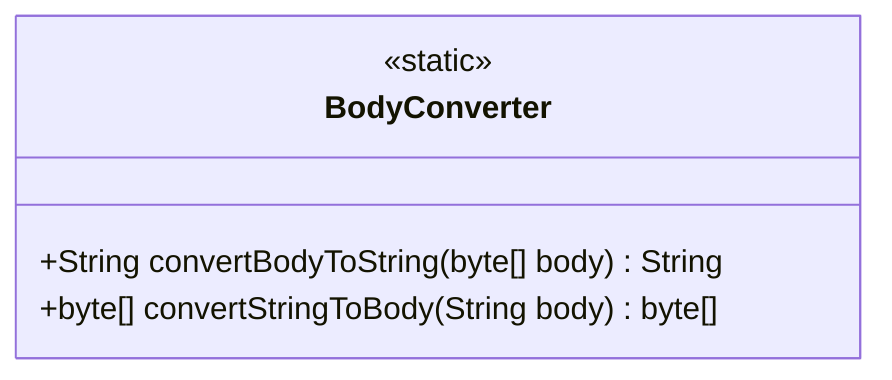
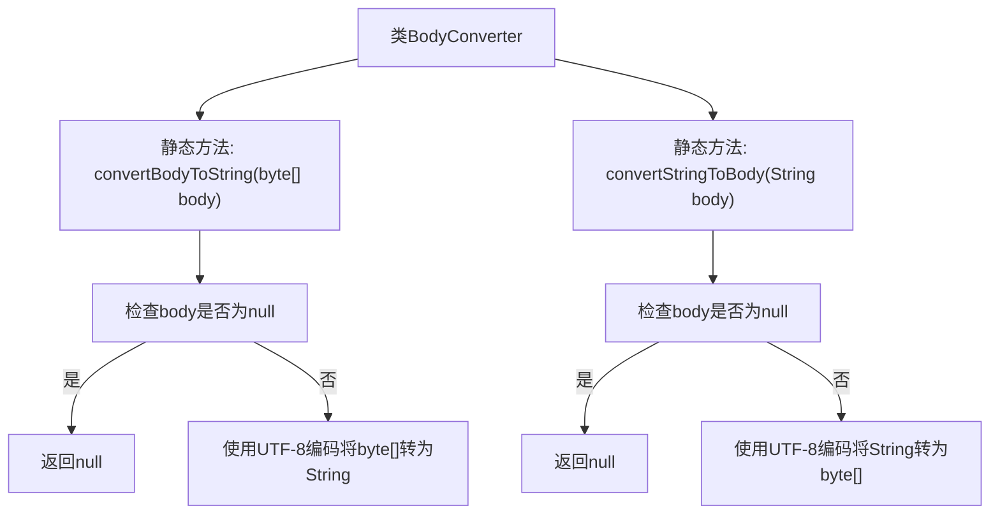

# 基础信息

|      |      |
|------|------|
| 名称 | BodyConverter |
| 编码语言 | .java |
| 代码路径 | staffjoy/faraday/src/main/java/xyz/staffjoy/faraday/core/utils/BodyConverter.java |
| 包名 | xyz.staffjoy.faraday.core.utils |
| 依赖项 | ['java.nio.charset.Charset.forName'] |
| 概述说明 | BodyConverter类提供UTF-8编码的字节数组与字符串互转方法。 |

# 说明

BodyConverter类提供了两个静态方法用于字节数组与字符串的相互转换。convertBodyToString方法将字节数组转换为UTF-8编码的字符串，若输入为空则返回null。convertStringToBody方法将字符串转换为UTF-8编码的字节数组，同样处理空输入情况。两个方法均使用UTF-8字符集进行编码转换。

# 类列表 Class Summary

| 名称   | 类型  | 说明 |
|-------|------|-------------|
| BodyConverter | class | BodyConverter类提供UTF-8编码的字节数组与字符串互转方法。 |

## 类 BodyConverter

|      |      |
|------|------|
| 访问范围 | public |
| 类型 | class |
| 名称 | BodyConverter |
| 说明 | BodyConverter类提供UTF-8编码的字节数组与字符串互转方法。 |

### UML类图

这段代码定义了一个名为BodyConverter的工具类，包含两个静态方法用于字节数组与字符串之间的相互转换。convertBodyToString方法将字节数组转换为UTF-8编码的字符串，处理null输入时直接返回null；convertStringToBody则执行反向操作，将字符串转为UTF-8字节数组。两个方法都使用UTF-8字符集进行编解码，体现了对字符编码一致性的严格要求，同时通过null检查避免了空指针异常。

### 内部方法调用关系图

这段代码定义了一个BodyConverter工具类，包含两个静态方法用于字节数组和字符串之间的相互转换。convertBodyToString方法将字节数组转换为UTF-8编码的字符串，convertStringToBody则执行反向操作。两个方法都包含空值检查，当输入为null时直接返回null，避免空指针异常。流程图清晰地展示了两个方法的执行路径和条件分支，体现了对边缘情况的处理。

### 字段列表 Field List

| 名称  | 类型  | 说明 |
|-------|-------|------|

### 方法列表 Method List

| 名称  | 类型  | 说明 |
|-------|-------|------|
| convertStringToBody | byte[] | 将字符串转为UTF-8字节数组，输入空则返回空。 |
| convertBodyToString | String | 将字节数组转为UTF-8字符串，空则返回空。 |

