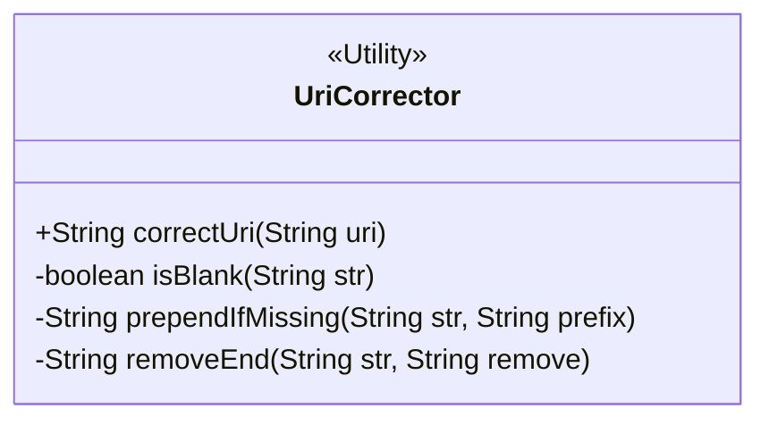
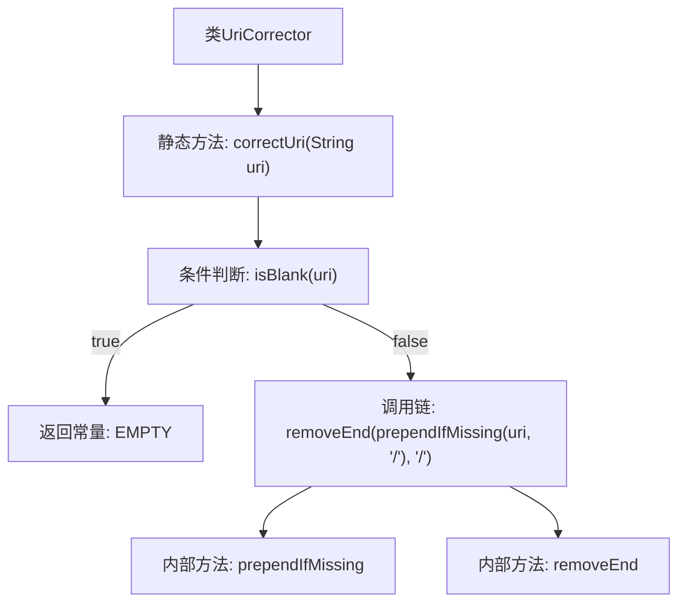

# 基础信息

|      |      |
|------|------|
| 名称 | UriCorrector |
| 编码语言 | .java |
| 代码路径 | staffjoy/faraday/src/main/java/xyz/staffjoy/faraday/core/utils/UriCorrector.java |
| 包名 | xyz.staffjoy.faraday.core.utils |
| 依赖项 | ['org.apache.commons.lang3.StringUtils'] |
| 概述说明 | URI修正工具类：空返回空，非空补斜杠并去尾斜杠。 |

# 说明

该代码定义了一个名为UriCorrector的公共类，包含一个静态方法correctUri用于修正URI字符串。方法首先检查输入URI是否为空或空白，若是则返回空字符串。否则对URI进行两步处理：确保以斜杠开头（若无则添加），并移除末尾多余的斜杠。最终返回修正后的URI字符串。

# 类列表 Class Summary

| 名称   | 类型  | 说明 |
|-------|------|-------------|
| UriCorrector | class | UriCorrector类提供静态方法correctUri，用于修正URI格式，确保以单斜杠结尾。 |

## 类 UriCorrector

|      |      |
|------|------|
| 访问范围 | public |
| 类型 | class |
| 名称 | UriCorrector |
| 说明 | UriCorrector类提供静态方法correctUri，用于修正URI格式，确保以单斜杠结尾。 |

### UML类图

该类图展示了一个工具类 `UriCorrector`，主要用于处理URI字符串的格式修正。它包含一个公有方法 `correctUri` 用于规范化URI（确保以单斜杠开头且不以斜杠结尾），以及三个私有辅助方法：`isBlank` 检查字符串空值，`prependIfMissing` 确保前缀存在，`removeEnd` 移除尾部指定字符。该类被标记为 `<<Utility>>` 表示其无状态工具类的特性，所有方法均为静态方法，适用于路径处理等场景。

### 内部方法调用关系图

这段流程图描述了UriCorrector类的correctUri方法逻辑流程。首先检查输入uri是否为空，若为空则返回空常量；否则执行两步操作：先通过prependIfMissing确保uri以"/"开头，再通过removeEnd确保不以"/"结尾。整个流程展示了URI格式化的完整处理逻辑，包括边界条件处理和链式方法调用。

### 字段列表 Field List

| 名称  | 类型  | 说明 |
|-------|-------|------|

### 方法列表 Method List

| 名称  | 类型  | 说明 |
|-------|-------|------|
| correctUri | String | 修正URI：空返回空，非空则确保以单斜杠开头且结尾无斜杠。 |

