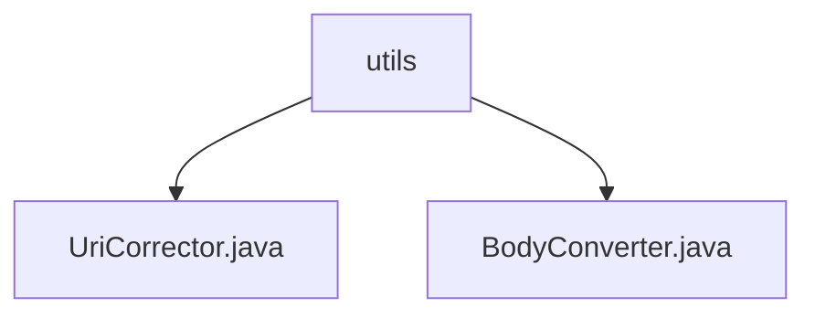

# 基础信息

|      |      |
|------|------|
| 名称 | utils |
| 编码语言 | .java |
| 代码路径 | staffjoy/faraday/src/main/java/xyz/staffjoy/faraday/core/utils |
| 包名 | staffjoy.docs.faraday.src.main.java.xyz.staffjoy.faraday.core.utils |
| 概述说明 | UriCorrector类修正URI格式，BodyConverter类处理字节与字符串转换。 |

# 说明

## 概述  
该代码模块包含两个核心工具类，主要用于URI处理和HTTP请求体的编码转换：  
1. **UriCorrector**：提供URI字符串的标准化修正功能，确保URI格式统一（如斜杠处理）。  
2. **BodyConverter**：实现HTTP请求体内容在字节数组与字符串之间的双向转换，采用UTF-8编码标准。  

## 主要业务场景  
1. **URI修正**：  
   - 适用于代理转发、路由匹配等场景，规范化输入的URI路径（如确保前缀斜杠、去除冗余后缀斜杠）。  
   - 典型用例：在HTTP请求转发前对目标URI进行预处理，避免因格式差异导致的路由失败。  

2. **请求体编码转换**：  
   - 处理HTTP请求/响应体的内容转换，例如将接收的字节流转换为可读字符串，或将字符串序列化为字节数组发送。  
   - 典型用例：日志记录、请求内容调试或跨系统数据交互时的编码统一。  

模块设计特点：  
- 纯工具类实现，所有方法均为静态，无状态依赖。  
- 空值安全处理（如返回`null`或空字符串），增强鲁棒性。

### 包内部结构视图

该流程图展示了staffjoy/faraday项目中core/utils目录下的文件结构关系。根节点utils包含两个Java文件：UriCorrector.java和BodyConverter.java，这两个文件都直接隶属于utils目录，没有更深层级的子目录结构。整个结构简洁明了，体现了工具类文件的典型组织方式。

# 文件列表 File List

| 名称   | 类型  | 说明 |
|-------|------|-------------|
| [BodyConverter.java](BodyConverter.md) | file | BodyConverter类提供UTF-8编码的字节数组与字符串互转方法。 |
| [UriCorrector.java](UriCorrector.md) | file | URI修正工具类：空返回空，非空补斜杠并去尾斜杠。 |

