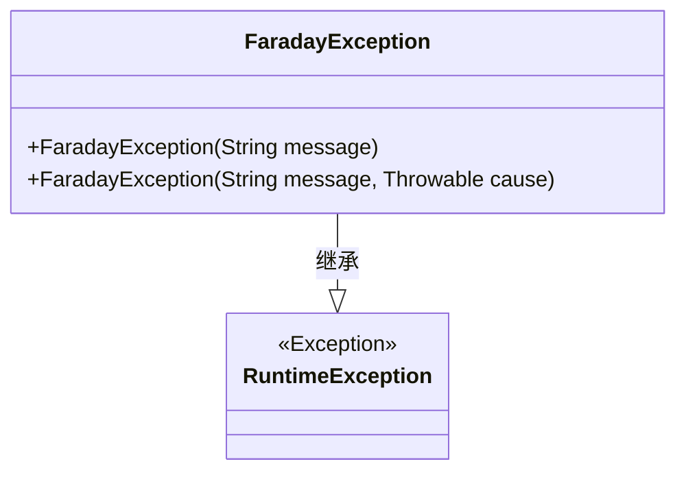
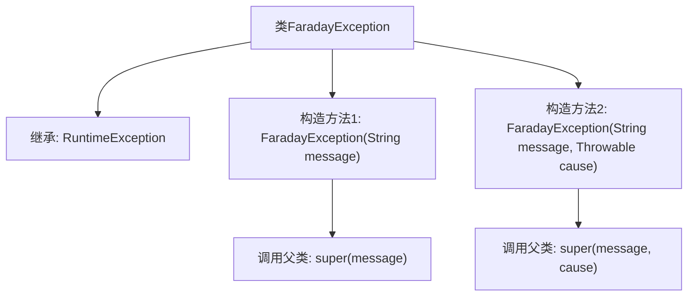

# 基础信息

|      |      |
|------|------|
| 名称 | FaradayException |
| 编码语言 | .java |
| 代码路径 | staffjoy/faraday/src/main/java/xyz/staffjoy/faraday/exceptions/FaradayException.java |
| 包名 | xyz.staffjoy.faraday.exceptions |
| 依赖项 | [] |
| 概述说明 | 自定义异常类FaradayException，继承RuntimeException，提供两种构造方法。 |

# 说明

FaradayException是一个继承自RuntimeException的自定义异常类，提供了两种构造函数。第一种构造函数接受一个字符串参数message，用于传递异常信息。第二种构造函数除了message参数外，还接受一个Throwable类型的cause参数，用于指定导致该异常的根本原因。这两种构造函数都调用了父类RuntimeException的相应构造函数来初始化异常对象。该异常类用于在程序运行过程中表示错误情况，并且由于继承自RuntimeException，属于非受检异常。

# 类列表 Class Summary

| 名称   | 类型  | 说明 |
|-------|------|-------------|
| FaradayException | class | 自定义异常类FaradayException，继承RuntimeException，支持消息和原因构造。 |

## 类 FaradayException

|      |      |
|------|------|
| 访问范围 | public |
| 类型 | class |
| 名称 | FaradayException |
| 说明 | 自定义异常类FaradayException，继承RuntimeException，支持消息和原因构造。 |

### UML类图

这段代码定义了一个名为FaradayException的自定义异常类，它继承自Java标准库中的RuntimeException类。该类提供了两个构造函数：一个接收字符串类型的错误消息参数，另一个同时接收错误消息和Throwable类型的异常原因参数。通过继承RuntimeException，该异常属于非受检异常(unchecked exception)，使用时不需要显式声明或捕获。类图清晰地展示了继承关系和构造方法，适用于需要自定义运行时异常的场景。

### 内部方法调用关系图

该流程图展示了FaradayException类的继承关系和构造方法调用逻辑。这个自定义异常类继承自RuntimeException，提供两种构造方法：一种接收错误消息参数并调用父类单参数构造方法；另一种同时接收错误消息和原因异常对象，调用父类双参数构造方法。这种设计遵循了Java异常处理的最佳实践，允许同时传递错误描述和底层原因。

### 字段列表 Field List

| 名称  | 类型  | 说明 |
|-------|-------|------|

### 方法列表 Method List

| 名称  | 类型  | 说明 |
|-------|-------|------|

