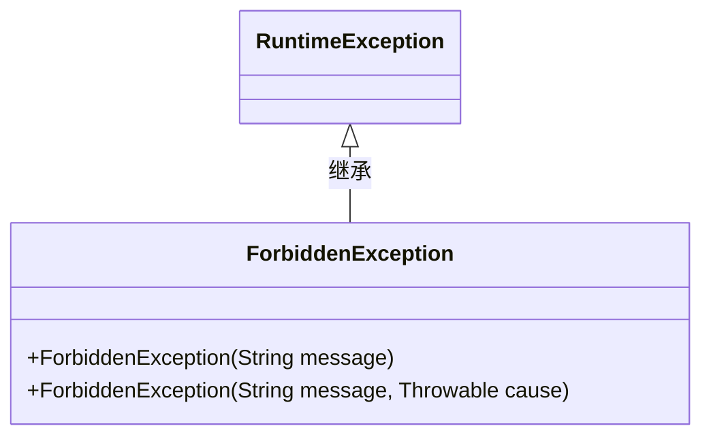
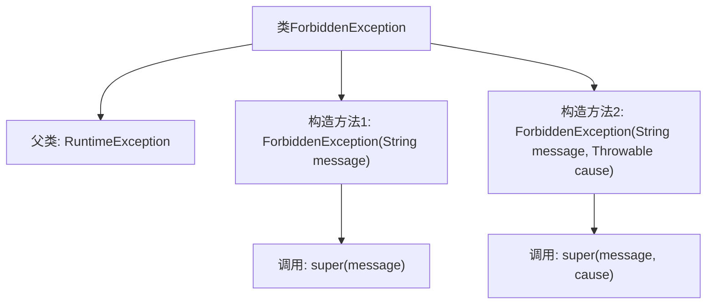

# 基础信息

|      |      |
|------|------|
| 名称 | ForbiddenException |
| 编码语言 | .java |
| 代码路径 | staffjoy/faraday/src/main/java/xyz/staffjoy/faraday/exceptions/ForbiddenException.java |
| 包名 | xyz.staffjoy.faraday.exceptions |
| 依赖项 | [] |
| 概述说明 | 自定义异常类ForbiddenException，继承RuntimeException，支持消息和原因构造。 |

# 说明

这是一个名为ForbiddenException的Java异常类，继承自RuntimeException。它提供了两种构造函数：第一种接受一个字符串参数作为异常消息；第二种除了消息外还接受一个Throwable参数作为异常原因。该类用于表示禁止访问或操作的运行时异常情况。

# 类列表 Class Summary

| 名称   | 类型  | 说明 |
|-------|------|-------------|
| ForbiddenException | class | 自定义异常类，表示禁止操作，支持消息和原因。 |

## 类 ForbiddenException

|      |      |
|------|------|
| 访问范围 | public |
| 类型 | class |
| 名称 | ForbiddenException |
| 说明 | 自定义异常类，表示禁止操作，支持消息和原因。 |

### UML类图

这段类图展示了ForbiddenException类继承自RuntimeException的关系。ForbiddenException是一个自定义运行时异常类，提供了两种构造函数：一种接收错误消息，另一种同时接收错误消息和原因异常。这种设计允许在权限校验失败等场景下抛出特定异常，同时保留原始异常信息以便调试。类图清晰地体现了异常类的层次结构和核心方法。

### 内部方法调用关系图

该流程图展示了ForbiddenException类的继承关系和构造方法调用逻辑。作为RuntimeException的子类，它包含两个重载构造方法：一个接收错误消息参数，另一个同时接收消息和异常原因参数。两个构造方法都通过super()调用父类对应构造函数，实现了异常信息的传递。这种设计模式是Java异常处理的典型扩展方式，允许开发者灵活地创建带有不同详细信息的自定义运行时异常。

### 字段列表 Field List

| 名称  | 类型  | 说明 |
|-------|-------|------|

### 方法列表 Method List

| 名称  | 类型  | 说明 |
|-------|-------|------|

