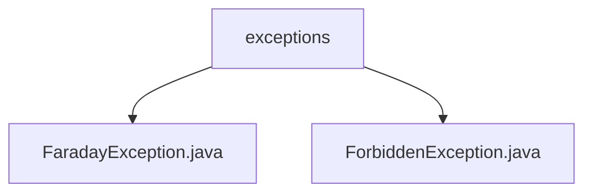

# 基础信息

|      |      |
|------|------|
| 名称 | exceptions |
| 编码语言 | .java |
| 代码路径 | staffjoy/faraday/src/main/java/xyz/staffjoy/faraday/exceptions |
| 包名 | staffjoy.docs.faraday.src.main.java.xyz.staffjoy.faraday.exceptions |
| 概述说明 | FaradayException和ForbiddenException均继承RuntimeException，提供带消息和原因的构造函数，用于处理运行时错误。 |

# 说明

## 概述  
该代码模块是一个异常处理相关的子模块，包含两个自定义异常类：`FaradayException` 和 `ForbiddenException`。这两个异常均继承自 `RuntimeException`，属于非受检异常，用于在程序运行时表示特定的错误情况。  

## 主要业务场景  
1. **`FaradayException`**  
   - 用于表示通用的运行时错误情况。  
   - 提供两种构造函数：  
     - 仅包含异常信息的构造函数（`message`）。  
     - 包含异常信息和根本原因的构造函数（`message` 和 `cause`）。  
   - 适用于需要传递错误信息或捕获异常链的场景。  

2. **`ForbiddenException`**  
   - 专门用于表示禁止访问或操作的运行时异常。  
   - 同样提供两种构造函数：  
     - 仅包含异常信息的构造函数（`message`）。  
     - 包含异常信息和根本原因的构造函数（`message` 和 `cause`）。  
   - 适用于权限校验失败或非法操作等业务场景。  

这两个异常类为模块提供了灵活的异常处理能力，支持错误信息的传递和异常原因的追溯。

### 包内部结构视图

该流程图展示了Staffjoy Faraday项目中异常处理模块的层级结构。根节点为exceptions文件夹，包含两个具体的异常类文件：FaradayException.java作为基础异常类，ForbiddenException.java表示权限禁止异常。这种结构体现了典型的Java异常处理设计模式，基础异常类派生特定业务异常，便于统一管理和维护异常处理逻辑。

# 文件列表 File List

| 名称   | 类型  | 说明 |
|-------|------|-------------|
| [ForbiddenException.java](ForbiddenException.md) | file | 自定义异常类ForbiddenException，继承RuntimeException，支持消息和原因构造。 |
| [FaradayException.java](FaradayException.md) | file | 自定义异常类FaradayException，继承RuntimeException，提供两种构造方法。 |

