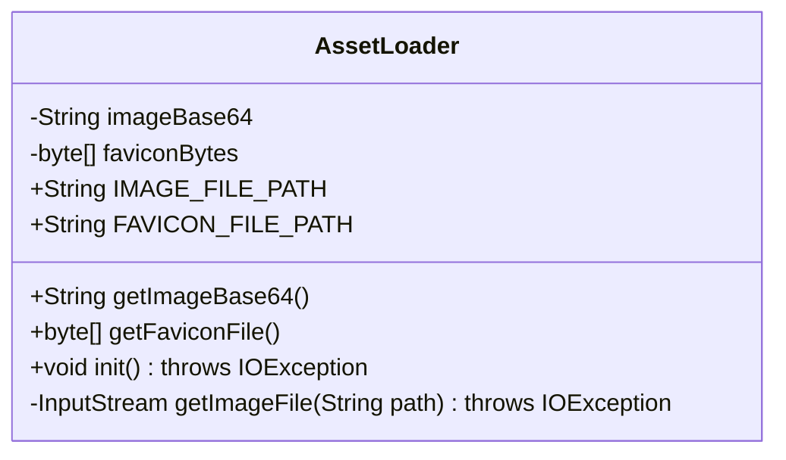
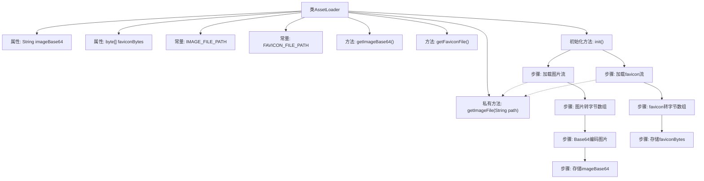

# 基础信息

|      |      |
|------|------|
| 名称 | AssetLoader |
| 编码语言 | .java |
| 代码路径 | staffjoy/faraday/src/main/java/xyz/staffjoy/faraday/view/AssetLoader.java |
| 包名 | xyz.staffjoy.faraday.view |
| 依赖项 | ['org.apache.commons.io.IOUtils', 'org.springframework.core.io.ClassPathResource', 'org.springframework.stereotype.Component', 'org.springframework.util.Base64Utils', 'javax.annotation.PostConstruct', 'java.io.IOException', 'java.io.InputStream'] |
| 概述说明 | 资产加载类，初始化时加载图片和图标，提供获取方法。 |

# 说明

这是一个名为AssetLoader的Java类，用于加载和编码图像资源。它包含两个静态常量定义图像路径：IMAGE_FILE_PATH指向staffjoy_coffee.png，FAVICON_FILE_PATH指向favicon.ico。类中有两个私有字段：imageBase64存储Base64编码的图像数据，faviconBytes存储favicon的字节数组。提供了getImageBase64和getFaviconFile两个公共方法获取这些数据。在@PostConstruct注解的init方法中，它通过getImageFile方法从类路径加载图像文件，将主图像转换为Base64编码字符串，并将favicon读取为字节数组。getImageFile是一个私有辅助方法，使用ClassPathResource获取文件输入流。

# 类列表 Class Summary

| 名称   | 类型  | 说明 |
|-------|------|-------------|
| AssetLoader | class | 资产加载类，初始化时加载图片和图标，提供获取方法。 |

## 类 AssetLoader

|      |      |
|------|------|
| 访问范围 | @Component;public |
| 类型 | class |
| 名称 | AssetLoader |
| 说明 | 资产加载类，初始化时加载图片和图标，提供获取方法。 |

### UML类图

这段代码展示了一个Spring组件类`AssetLoader`，主要用于加载和编码静态资源文件。类中包含两个私有字段`imageBase64`和`faviconBytes`分别存储Base64编码的图片和原始字节数组形式的favicon，通过`@PostConstruct`注解的`init()`方法在初始化时加载指定路径的图片资源并进行Base64编码处理。类提供了两个公有方法`getImageBase64()`和`getFaviconFile()`供外部获取处理后的资源数据，而`getImageFile()`作为私有方法辅助完成文件读取功能。整个设计体现了资源预加载和封装的思想，适用于需要频繁访问静态资源的场景。

### 内部方法调用关系图

这段代码是Spring组件AssetLoader的实现，主要用于在初始化时加载并处理图片资源。流程图展示了类结构、属性常量、公共方法以及初始化时的关键步骤：通过getImageFile获取资源流，分别对主图片进行Base64编码存储，对favicon直接存储字节数组。私有方法getImageFile被两个资源加载步骤复用，体现了代码复用性。整个过程严格遵循资源加载、转换和存储的流程。

### 字段列表 Field List

| 名称  | 类型  | 说明 |
|-------|-------|------|
| faviconBytes | byte[] | 私有字节数组faviconBytes |
| IMAGE_FILE_PATH = "static/assets/images/staffjoy_coffee.png" | String | 静态图片路径：static/assets/images/staffjoy_coffee.png |
| imageBase64 | String | 图片Base64编码数据 |
| FAVICON_FILE_PATH = "static/assets/images/favicon.ico" | String | 定义静态常量FAVICON_FILE_PATH，值为favicon.ico文件路径。 |

### 方法列表 Method List

| 名称  | 类型  | 说明 |
|-------|-------|------|
| getFaviconFile | byte[] | 获取favicon文件的字节数组。 |
| getImageBase64 | String | 获取图片Base64数据的方法。 |
| init | void | 加载图片和图标并转为Base64编码。 |
| getImageFile | InputStream | 从类路径获取指定路径文件的输入流。 |

