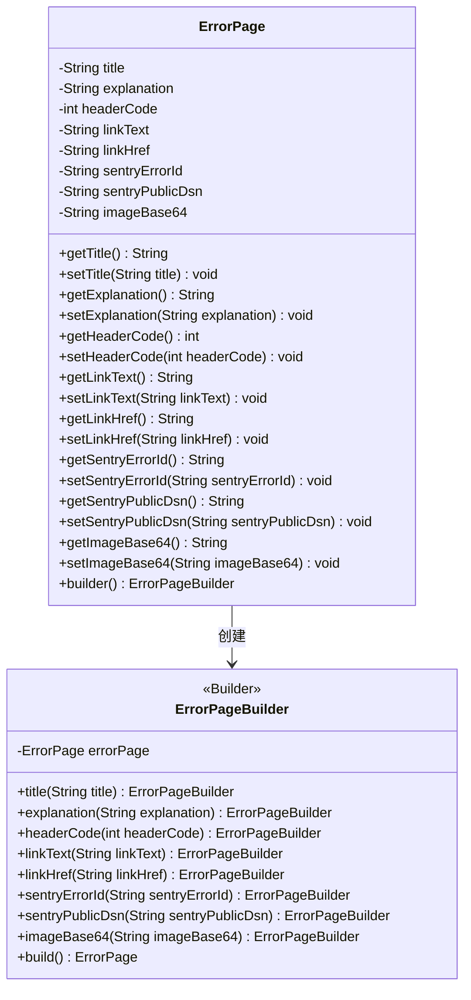
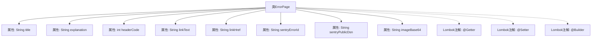

# 基础信息

|      |      |
|------|------|
| 名称 | ErrorPage |
| 编码语言 | .java |
| 代码路径 | staffjoy/faraday/src/main/java/xyz/staffjoy/faraday/view/ErrorPage.java |
| 包名 | xyz.staffjoy.faraday.view |
| 依赖项 | ['lombok.Builder', 'lombok.Getter', 'lombok.Setter'] |
| 概述说明 | 错误页类，含标题、说明、状态码、链接文本、链接地址、错误ID、DSN配置、Base64图片。 |

# 说明

该内容定义了一个名为ErrorPage的Java类，使用Lombok注解自动生成getter、setter和builder方法。类包含多个字段：title用于页面标题和一级标题，explanation向用户解释错误原因，headerCode存储HTTP状态码，linkText和linkHref分别定义跳转链接文本和地址，sentryErrorId用于后端错误追踪标识，sentryPublicDsn为Sentry配置项，imageBase64存储Base64编码的图片数据。整个类结构用于构建错误页面所需的数据模型。

# 类列表 Class Summary

| 名称   | 类型  | 说明 |
|-------|------|-------------|
| ErrorPage | class | 错误页类，含标题、说明、状态码、链接、跟踪ID、配置及图片。 |

## 类 ErrorPage

|      |      |
|------|------|
| 访问范围 | @Getter;@Setter;@Builder;public |
| 类型 | class |
| 名称 | ErrorPage |
| 说明 | 错误页类，含标题、说明、状态码、链接、跟踪ID、配置及图片。 |

### UML类图

这段代码定义了一个ErrorPage类，使用Lombok注解自动生成getter/setter和builder模式。该类包含错误页面所需的元数据，如标题、解释文本、HTTP状态码、导航链接信息、Sentry错误追踪ID和Base64编码的图片数据。通过Builder模式可以链式构建对象，适用于需要灵活构造复杂错误页面的场景，特别是在Web应用中统一处理错误响应时。类图展示了ErrorPage与ErrorPageBuilder的构建关系，体现了Lombok自动生成代码的结构特征。

### 内部方法调用关系图

该流程图展示了ErrorPage类的结构，包含8个私有属性和3个Lombok注解。title属性用于页面标题和主标题，explanation说明错误原因，headerCode存储HTTP状态码，linkText和linkHref定义导航链接，sentryErrorId和sentryPublicDsn用于错误追踪系统集成，imageBase64存储Base64编码图片。通过@Getter/@Setter自动生成访问器，@Builder提供建造者模式支持。整个类设计用于构建标准化的错误页面对象。

### 字段列表 Field List

| 名称  | 类型  | 说明 |
|-------|-------|------|
| explanation | String | 私有字符串变量explanation |
| title | String | 私有字符串变量title |
| linkText | String | 私有字符串变量linkText |
| linkHref | String | 私有字符串变量linkHref。 |
| headerCode | int | 私有整型变量headerCode |
| sentryErrorId | String | 私有字符串变量sentryErrorId |
| sentryPublicDsn | String | 私有字符串变量sentryPublicDsn |
| imageBase64 | String | 图片Base64编码数据 |

### 方法列表 Method List

| 名称  | 类型  | 说明 |
|-------|-------|------|

