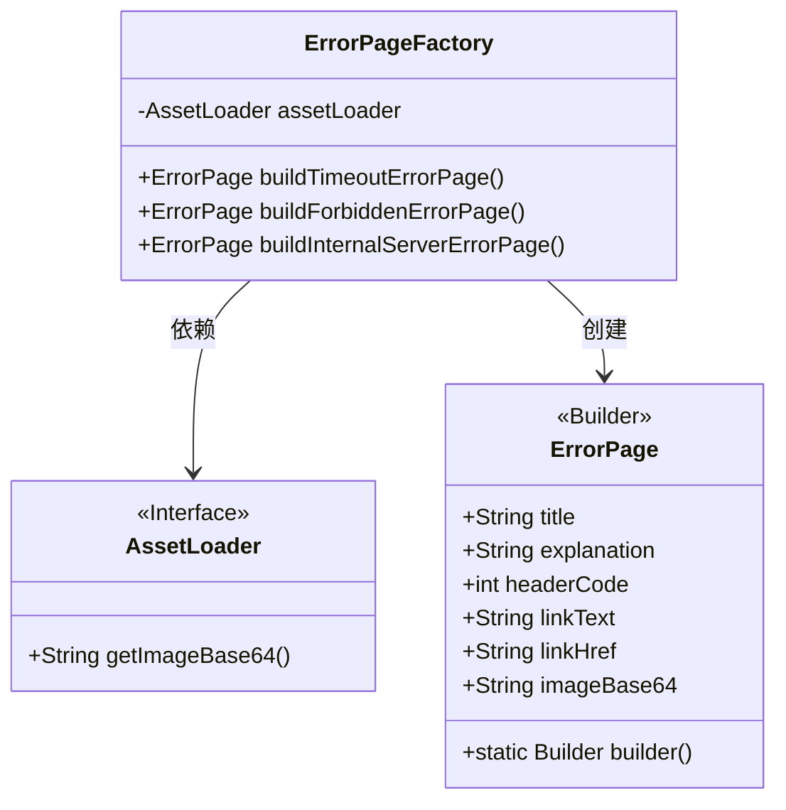
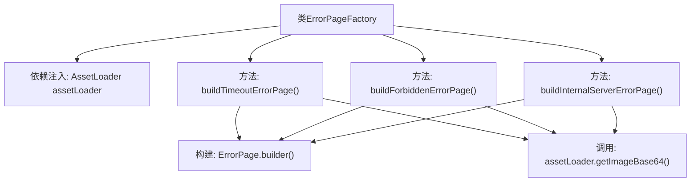

# 基础信息

|      |      |
|------|------|
| 名称 | ErrorPageFactory |
| 编码语言 | .java |
| 代码路径 | staffjoy/faraday/src/main/java/xyz/staffjoy/faraday/view/ErrorPageFactory.java |
| 包名 | xyz.staffjoy.faraday.view |
| 依赖项 | ['org.springframework.beans.factory.annotation.Autowired', 'org.springframework.http.HttpStatus', 'org.springframework.stereotype.Component'] |
| 概述说明 | ErrorPageFactory类生成超时、禁止访问和服务器错误页面，包含标题、说明、状态码、链接和图片。 |

# 说明

ErrorPageFactory类是一个用于构建不同类型错误页面的组件。它通过依赖注入的AssetLoader获取图像资源。类中包含三个方法：buildTimeoutErrorPage创建超时错误页面，包含超时提示和系统状态页链接；buildForbiddenErrorPage创建禁止访问页面，包含权限说明和支持邮箱链接；buildInternalServerErrorPage创建服务器错误页面，包含故障提示和状态页链接。每个方法都设置了对应的HTTP状态码、标题、说明文字和相关链接。

# 类列表 Class Summary

| 名称   | 类型  | 说明 |
|-------|------|-------------|
| ErrorPageFactory | class | ErrorPageFactory类生成超时、禁止访问和服务器错误页面。 |

## 类 ErrorPageFactory

|      |      |
|------|------|
| 访问范围 | @Component;public |
| 类型 | class |
| 名称 | ErrorPageFactory |
| 说明 | ErrorPageFactory类生成超时、禁止访问和服务器错误页面。 |

### UML类图

这段代码展示了一个错误页面工厂类(ErrorPageFactory)，它使用构建器模式创建不同类型的错误页面(ErrorPage)。工厂类依赖AssetLoader接口获取Base64编码的图像数据。ErrorPage类采用构建器设计模式，包含标题、说明、状态码、链接文本和链接地址等属性。工厂类提供了三种方法分别构建超时错误、禁止访问和服务器内部错误的页面，每种页面都有特定的标题、说明文字和相应的HTTP状态码。

### 内部方法调用关系图

这段代码展示了一个Spring组件类ErrorPageFactory，用于构建不同类型的错误页面。该类通过@Autowired注入AssetLoader来获取Base64编码的图片，提供了三个方法分别构建超时错误、禁止访问和服务器内部错误的页面。每个方法都使用建造者模式创建ErrorPage对象，设置标题、说明文字、HTTP状态码、链接文本和图片等属性。流程图清晰地展示了类结构、方法调用关系和依赖注入关系。

### 字段列表 Field List

| 名称  | 类型  | 说明 |
|-------|-------|------|
| assetLoader | AssetLoader | 自动注入AssetLoader实例。 |

### 方法列表 Method List

| 名称  | 类型  | 说明 |
|-------|-------|------|
| buildTimeoutErrorPage | ErrorPage | 构建超时错误页：标题"Timeout Error"，说明服务器慢请重试，状态码504，含系统状态页链接和Base64图片。 |
| buildForbiddenErrorPage | ErrorPage | 构建禁止访问错误页，含标题、说明、状态码、支持链接和图片。 |
| buildInternalServerErrorPage | ErrorPage | 构建内部服务器错误页面，含标题、说明、状态码、链接和图片。 |

