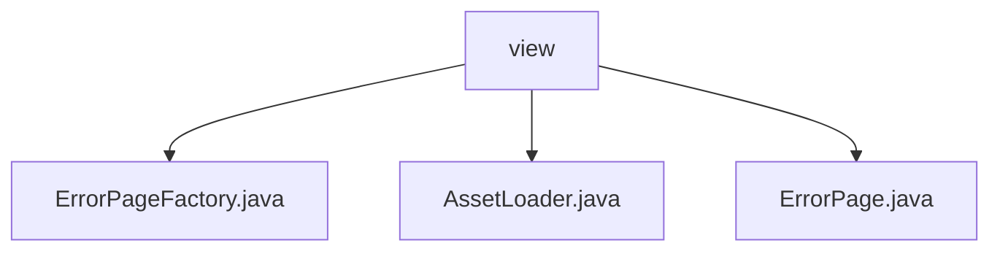

# 基础信息

|      |      |
|------|------|
| 名称 | view |
| 编码语言 | .java |
| 代码路径 | staffjoy/faraday/src/main/java/xyz/staffjoy/faraday/view |
| 包名 | staffjoy.docs.faraday.src.main.java.xyz.staffjoy.faraday.view |
| 概述说明 | ErrorPageFactory构建错误页，AssetLoader加载图像资源，ErrorPage定义错误页数据结构。 |

# 说明

## 概述  
该代码模块是一个错误页面处理系统，主要用于构建和展示不同类型的HTTP错误页面。核心功能包括错误页面的动态生成、图像资源加载以及错误数据模型的定义。模块通过工厂模式创建特定类型的错误页面（如超时错误、禁止访问错误、服务器内部错误等），并统一管理图像资源和页面数据模型。

## 主要业务场景  
1. **错误页面生成**  
   - 通过`ErrorPageFactory`类根据不同的错误类型（超时、禁止访问、服务器内部错误）生成对应的错误页面，设置相应的HTTP状态码、标题、说明文字和相关链接。  
   - 支持用户友好的错误提示，并提供跳转链接（如系统状态页、支持邮箱等）。  

2. **资源加载与编码**  
   - `AssetLoader`类负责从类路径加载图像资源（如Logo和favicon），并将其转换为Base64编码或字节数组，供错误页面使用。  
   - 确保错误页面中的图像资源能够正确加载和展示。  

3. **错误数据模型定义**  
   - `ErrorPage`类定义了错误页面的数据模型，包含标题、错误说明、HTTP状态码、跳转链接、Sentry错误追踪标识等字段。  
   - 通过Lombok简化代码，自动生成getter、setter和builder方法，便于构建和传递错误页面数据。  

该模块适用于需要统一处理HTTP错误场景的Web应用，能够快速生成标准化的错误页面，提升用户体验和故障排查效率。

### 包内部结构视图

该流程图展示了staffjoy/faraday项目下view目录的层级结构。根节点为view文件夹，包含三个直接子文件：ErrorPageFactory.java、AssetLoader.java和ErrorPage.java。这些文件都属于视图层组件，其中ErrorPageFactory可能用于生成错误页面，AssetLoader负责资源加载，ErrorPage则是错误页面的具体实现类。整个结构简洁明了，体现了典型的MVC架构中视图层的文件组织方式。

# 文件列表 File List

| 名称   | 类型  | 说明 |
|-------|------|-------------|
| [ErrorPage.java](ErrorPage.md) | file | 错误页类，含标题、说明、状态码、链接文本、链接地址、错误ID、DSN配置、Base64图片。 |
| [AssetLoader.java](AssetLoader.md) | file | 资产加载类，初始化时加载图片和图标，提供获取方法。 |
| [ErrorPageFactory.java](ErrorPageFactory.md) | file | ErrorPageFactory类生成超时、禁止访问和服务器错误页面，包含标题、说明、状态码、链接和图片。 |

