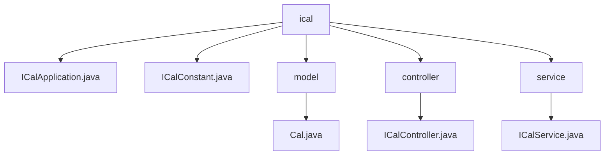

# 基础信息

|      |      |
|------|------|
| 名称 | xyz |
| 编码语言 | .java |
| 代码路径 | staffjoy/ical-svc/src/main/java/xyz |
| 包名 | staffjoy.docs.ical-svc.src.main.java.xyz |
| 概述说明 | 
Java类生成iCalendar数据，包含控制器处理请求，服务获取信息，Spring Boot应用入口和常量定义。 |

# 说明

## 概述
该代码模块是一个基于Spring Boot的iCalendar服务，主要用于生成和提供iCalendar格式的排班数据。模块通过REST API提供用户排班信息的iCalendar格式下载功能，支持标准日历协议的数据生成和响应处理。

## 主要业务场景
1. **iCalendar数据生成**：通过`Cal`类将公司排班信息转换为符合iCalendar协议格式的数据，包含事件组织者、摘要、时间等完整字段。
2. **日历数据下载服务**：通过`ICalController`提供HTTP接口，允许用户通过GET请求下载个人排班日历（格式为`.ics`文件）。
3. **业务数据整合**：`ICalService`负责整合公司服务（通过Feign客户端）获取团队信息、公司详情和排班列表，构建日历数据模型。
4. **异常处理与监控**：服务层捕获异常时通过Sentry上报错误，并转换为统一的业务异常返回。
5. **微服务集成**：作为Spring Boot应用，通过`@EnableFeignClients`集成其他微服务，同时排除不必要的数据源自动配置。

### 包内部结构视图

该流程图展示了ical-svc项目的核心结构，根节点为ical目录，包含应用入口文件、常量定义以及model、controller、service三个子模块。其中model包含日历数据模型，controller处理请求路由，service实现业务逻辑，各模块间层级关系清晰，符合典型Spring Boot应用的分层架构。

# 文件列表 File List

| 名称   | 类型  | 说明 |
|-------|------|-------------|
| [staffjoy](staffjoy/_module.md) | package | 
Java类生成iCalendar数据，包含控制器处理请求，服务获取信息，Spring Boot应用入口和常量定义。 |

