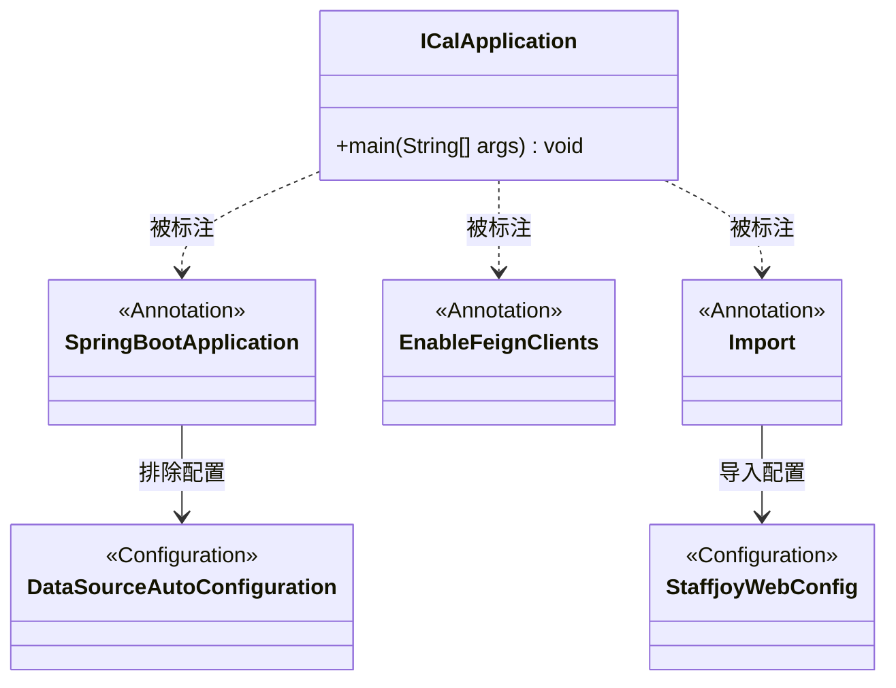
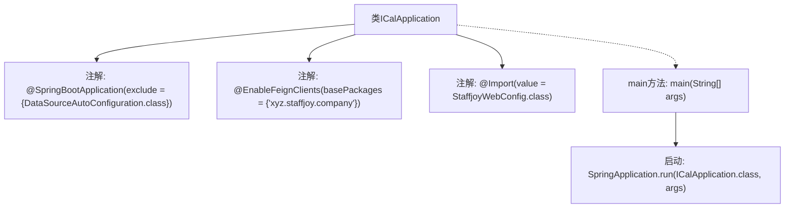

# 基础信息

|      |      |
|------|------|
| 名称 | ICalApplication |
| 编码语言 | .java |
| 代码路径 | staffjoy/ical-svc/src/main/java/xyz/staffjoy/ical/ICalApplication.java |
| 包名 | xyz.staffjoy.ical |
| 依赖项 | ['org.springframework.boot.SpringApplication', 'org.springframework.boot.autoconfigure.SpringBootApplication', 'org.springframework.boot.autoconfigure.jdbc.DataSourceAutoConfiguration', 'org.springframework.cloud.openfeign.EnableFeignClients', 'org.springframework.context.annotation.Import', 'xyz.staffjoy.common.config.StaffjoyWebConfig'] |
| 概述说明 | SpringBoot应用，排除数据源配置，启用Feign客户端，导入Web配置。 |

# 说明

该内容描述了一个名为ICalApplication的Java类，使用Spring Boot框架。类上标注了@SpringBootApplication注解，并排除了DataSourceAutoConfiguration自动配置。同时通过@EnableFeignClients启用了Feign客户端，指定了基础包路径。还导入了StaffjoyWebConfig配置类。主方法通过SpringApplication.run启动应用。整个类是一个Spring Boot应用的入口点。

# 类列表 Class Summary

| 名称   | 类型  | 说明 |
|-------|------|-------------|
| ICalApplication | class | SpringBoot应用，排除数据源配置，启用Feign客户端，导入Web配置。 |

## 类 ICalApplication

|      |      |
|------|------|
| 访问范围 | @SpringBootApplication(exclude = {DataSourceAutoConfiguration.class});@EnableFeignClients(basePackages = {"xyz.staffjoy.company"});@Import(value = StaffjoyWebConfig.class);public |
| 类型 | class |
| 名称 | ICalApplication |
| 说明 | SpringBoot应用，排除数据源配置，启用Feign客户端，导入Web配置。 |

### UML类图

这段代码描述了一个Spring Boot应用启动类ICalApplication，通过注解配置了应用行为。@SpringBootApplication排除了数据源自动配置，@EnableFeignClients启用了对指定包下Feign客户端的支持，@Import导入了自定义Web配置StaffjoyWebConfig。类图展示了启动类与各注解及配置类之间的标注和依赖关系，体现了Spring Boot应用的典型配置方式。

### 内部方法调用关系图

该流程图展示了ICalApplication类的核心结构和启动流程。类通过三个关键注解配置Spring Boot应用：排除数据源自动配置、启用Feign客户端扫描指定包路径、导入自定义Web配置。主方法通过SpringApplication.run()启动应用，箭头清晰标注了从类声明到注解再到启动方法的层级关系，完整呈现了Spring Boot应用的初始化路径。

### 字段列表 Field List

| 名称  | 类型  | 说明 |
|-------|-------|------|

### 方法列表 Method List

| 名称  | 类型  | 说明 |
|-------|-------|------|
| main | void | Java启动Spring应用的main方法。 |

