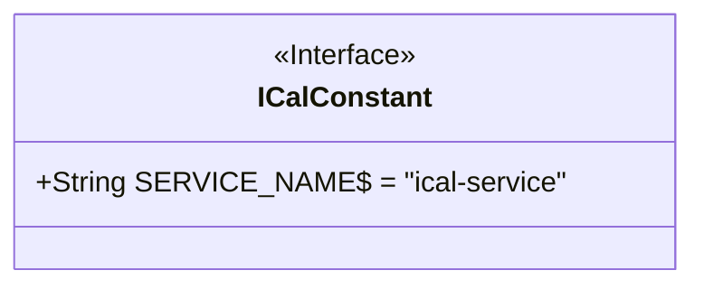
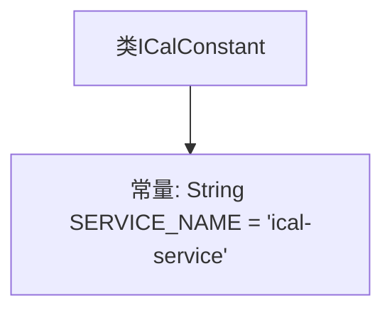

# 基础信息

|      |      |
|------|------|
| 名称 | ICalConstant |
| 编码语言 | .java |
| 代码路径 | staffjoy/ical-svc/src/main/java/xyz/staffjoy/ical/ICalConstant.java |
| 包名 | xyz.staffjoy.ical |
| 依赖项 | [] |
| 概述说明 | 定义ICalConstant类，包含静态常量SERVICE_NAME。 |

# 说明

该内容定义了一个名为ICalConstant的Java公共类，其中包含一个静态常量字段SERVICE_NAME，其值为字符串"ical-service"。该常量字段被声明为public static final，表示它是一个公开的、不可修改的类级别常量。这个类可能用于存储与iCal服务相关的全局常量。

# 类列表 Class Summary

| 名称   | 类型  | 说明 |
|-------|------|-------------|
| ICalConstant | class | 定义ICalConstant类，包含服务名常量SERVICE_NAME。 |

## 类 ICalConstant

|      |      |
|------|------|
| 访问范围 | public |
| 类型 | class |
| 名称 | ICalConstant |
| 说明 | 定义ICalConstant类，包含服务名常量SERVICE_NAME。 |

### UML类图

这段代码定义了一个名为`ICalConstant`的接口，其中包含一个公开静态常量`SERVICE_NAME`，其值为"ical-service"。该接口可能用于集中管理iCalendar相关服务的常量配置。由于所有字段在接口中默认为`public static final`，因此无需显式声明这些修饰符。类图清晰地展示了这是一个标记为`<<Interface>>`的接口类型，并通过`$`符号表示静态字段的特性。

### 内部方法调用关系图

这段代码定义了一个名为ICalConstant的类，其中包含一个公开静态常量SERVICE_NAME，其值为"ical-service"。该常量通常用于标识服务名称，可能在多个类中被引用。由于是final常量，其值不可修改，适合作为配置参数或全局标识符使用。整个类结构非常简单，仅包含一个常量定义，没有方法或其他成员变量。

### 字段列表 Field List

| 名称  | 类型  | 说明 |
|-------|-------|------|
| SERVICE_NAME = "ical-service" | String | 服务名称为"ical-service"。 |

### 方法列表 Method List

| 名称  | 类型  | 说明 |
|-------|-------|------|

