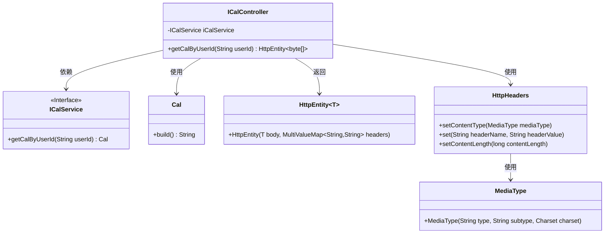
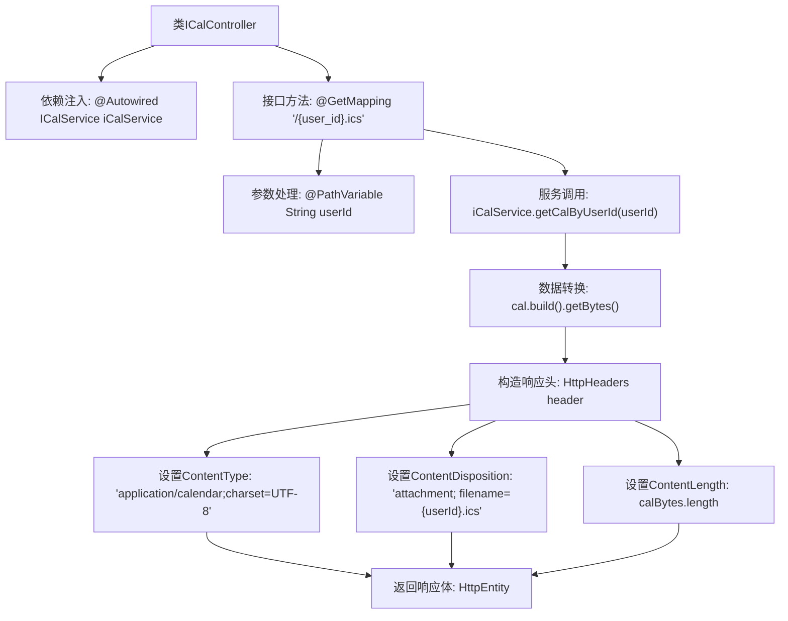

# 基础信息

|      |      |
|------|------|
| 名称 | ICalController |
| 编码语言 | .java |
| 代码路径 | staffjoy/ical-svc/src/main/java/xyz/staffjoy/ical/controller/ICalController.java |
| 包名 | xyz.staffjoy.ical.controller |
| 依赖项 | ['org.springframework.beans.factory.annotation.Autowired', 'org.springframework.http.HttpEntity', 'org.springframework.http.HttpHeaders', 'org.springframework.http.MediaType', 'org.springframework.stereotype.Controller', 'org.springframework.web.bind.annotation.GetMapping', 'org.springframework.web.bind.annotation.PathVariable', 'org.springframework.web.bind.annotation.ResponseBody', 'xyz.staffjoy.ical.model.Cal', 'xyz.staffjoy.ical.service.ICalService', 'java.nio.charset.Charset'] |
| 概述说明 | Spring控制器通过用户ID返回ICS格式日历文件。 |

# 说明

这是一个Spring MVC控制器类ICalController，用于处理iCalendar格式的请求。它通过@Autowired注入ICalService服务，提供GET接口"/{user_id}.ics"来获取指定用户的日历数据。方法接收用户ID路径参数，调用服务层获取日历对象，将其转换为字节数组。响应设置Content-Type为"application/calendar"并指定UTF-8编码，添加Content-Disposition头部使返回内容作为附件下载，文件名为用户ID.ics，最后返回包含日历数据和HTTP头部的HttpEntity对象。

# 类列表 Class Summary

| 名称   | 类型  | 说明 |
|-------|------|-------------|
| ICalController | class | Spring控制器通过用户ID返回iCal日历文件。 |

## 类 ICalController

|      |      |
|------|------|
| 访问范围 | @Controller;public |
| 类型 | class |
| 名称 | ICalController |
| 说明 | Spring控制器通过用户ID返回iCal日历文件。 |

### UML类图

这段代码展示了一个Spring MVC控制器`ICalController`，它通过`ICalService`获取日历数据，构建ICS格式响应。控制器接收用户ID参数，调用服务层获取`Cal`对象，将其转换为字节数组后设置HTTP响应头（包括内容类型、附件文件名和长度），最后封装为`HttpEntity`返回。类图清晰地呈现了控制器与各组件间的依赖关系，包括服务接口、数据模型和HTTP响应处理类。

### 内部方法调用关系图

该流程图展示了Spring MVC控制器的完整处理流程。从接收带用户ID的URL请求开始，通过服务层获取日历数据，转换为字节数组后设置HTTP响应头（包括内容类型、下载文件名和长度），最后封装成响应实体返回。整个过程体现了RESTful接口的数据获取、处理和响应构建的标准化流程，特别注意了文件下载场景的特殊头设置。

### 字段列表 Field List

| 名称  | 类型  | 说明 |
|-------|-------|------|
| iCalService | ICalService | 自动注入ICalService服务实例 |

### 方法列表 Method List

| 名称  | 类型  | 说明 |
|-------|-------|------|
| getCalByUserId | HttpEntity<byte[]> | 获取用户日历数据并返回ICS格式文件。 |

