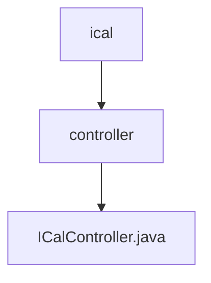

# 基础信息

|      |      |
|------|------|
| 名称 | controller |
| 编码语言 | .java |
| 代码路径 | staffjoy/ical-svc/src/main/java/xyz/staffjoy/ical/controller |
| 包名 | staffjoy.docs.ical-svc.src.main.java.xyz.staffjoy.ical.controller |
| 概述说明 | Spring控制器通过用户ID返回ICS格式日历文件。 |

# 说明

这是一个Spring MVC控制器类ICalController，用于处理iCalendar格式的请求。它通过@Autowired注入ICalService服务，提供GET接口"/{user_id}.ics"来获取指定用户的日历数据。方法接收用户ID路径参数，调用服务层获取日历对象，将其转换为字节数组。响应设置Content-Type为"application/calendar"并指定UTF-8编码，添加Content-Disposition头部使返回内容作为附件下载，文件名为用户ID.ics，最后返回包含日历数据和HTTP头部的HttpEntity对象。

### 包内部结构视图

该流程图展示了ical服务中控制器的层级结构。顶层是ical模块，其下包含controller子目录，controller目录中包含具体的ICalController.java控制器文件。这是一个典型的三层结构，体现了MVC架构中控制器层的组织方式，总节点数严格匹配输入路径数量。

# 文件列表 File List

| 名称   | 类型  | 说明 |
|-------|------|-------------|
| [ICalController.java](ICalController.md) | file | Spring控制器通过用户ID返回ICS格式日历文件。 |

