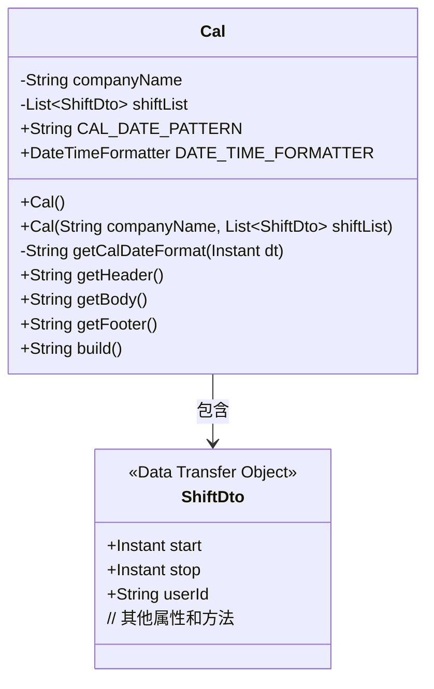
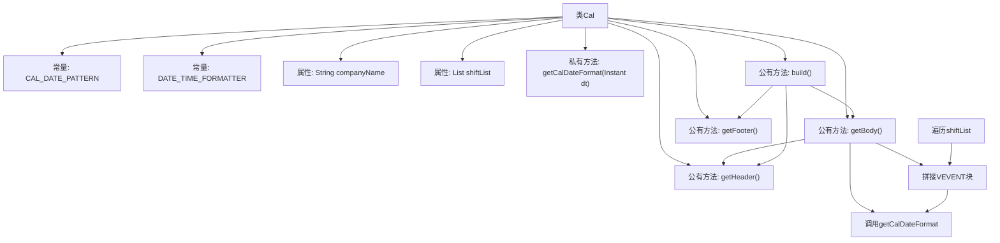

# 基础信息

|      |      |
|------|------|
| 名称 | Cal |
| 编码语言 | .java |
| 代码路径 | staffjoy/ical-svc/src/main/java/xyz/staffjoy/ical/model/Cal.java |
| 包名 | xyz.staffjoy.ical.model |
| 依赖项 | ['lombok.AllArgsConstructor', 'lombok.Builder', 'lombok.Data', 'lombok.NoArgsConstructor', 'xyz.staffjoy.company.dto.ShiftDto', 'java.time.Instant', 'java.time.ZoneId', 'java.time.format.DateTimeFormatter', 'java.util.List'] |
| 概述说明 | Cal类生成iCal格式日程，包含公司名和班次列表，支持构建完整日程内容。 |

# 说明

这是一个用于生成iCalendar格式数据的Java类。类名为Cal，包含公司名称和班次列表两个属性。定义了日期格式常量和格式化器，提供将Instant对象格式化为字符串的方法。类包含生成iCalendar头部、主体和尾部的方法：头部包含固定协议信息；主体遍历班次列表，为每个班次生成包含组织者、摘要、唯一标识、状态、起止时间等字段的事件块；尾部为固定结束标记。最后提供build方法拼接三部分内容生成完整iCalendar数据。类使用了Lombok注解简化代码，支持全参、无参构造器和建造者模式。

# 类列表 Class Summary

| 名称   | 类型  | 说明 |
|-------|------|-------------|
| Cal | class | Java类Cal生成iCalendar格式数据，包含公司名和班次列表，提供构建方法。 |

## 类 Cal

|      |      |
|------|------|
| 访问范围 | @Data;@AllArgsConstructor;@NoArgsConstructor;@Builder;public |
| 类型 | class |
| 名称 | Cal |
| 说明 | Java类Cal生成iCalendar格式数据，包含公司名和班次列表，提供构建方法。 |

### UML类图

类图描述：该图展示了Cal类与ShiftDto类的关系。Cal类是一个iCalendar生成器，包含公司名称和班次列表两个主要属性，以及日期格式化工具常量。核心功能包括生成iCalendar的头部(getHeader)、主体(getBody)和尾部(getFooter)，并通过build方法组合成完整内容。ShiftDto作为数据载体提供班次信息。类图中清晰体现了组合关系，Cal通过List包含多个ShiftDto对象。

### 内部方法调用关系图

这段代码是一个用于生成iCalendar格式数据的工具类。流程图展示了Cal类的核心结构，包括常量定义、私有属性、日期格式化方法以及构建iCalendar文档的四个关键方法。其中getHeader()生成文档头，getBody()通过遍历shiftList生成多个事件块，getFooter()生成文档尾，build()方法将三部分组合成完整文档。特别展示了getBody()内部对每个ShiftDto的处理流程，包括调用日期格式化和多字段拼接操作。

### 字段列表 Field List

| 名称  | 类型  | 说明 |
|-------|-------|------|
| companyName | String | 私有字符串变量存储公司名称。 |
| shiftList | List<ShiftDto> | 私有班次列表变量shiftList |
| CAL_DATE_PATTERN = "yyyyMMdd'T'HHmmssZ" | String | 定义日期格式常量：yyyyMMdd'T'HHmmssZ |
| DATE_TIME_FORMATTER = DateTimeFormatter.ofPattern(CAL_DATE_PATTERN)            .withZone(ZoneId.systemDefault()) | DateTimeFormatter | 定义日期格式化器，使用系统默认时区。 |

### 方法列表 Method List

| 名称  | 类型  | 说明 |
|-------|-------|------|
| getHeader | String | 生成iCalendar文件头，包含版本、方法和标识信息。 |
| getBody | String | 生成ICS格式日历事件，包含班次详情、时间、地点和状态。 |
| build | String | 构建方法返回拼接的头部、主体和尾部。 |
| getFooter | String | 方法返回字符串"END:VCALENDAR"。 |
| getCalDateFormat | String | 私有方法，用指定格式转换Instant日期为字符串。 |

