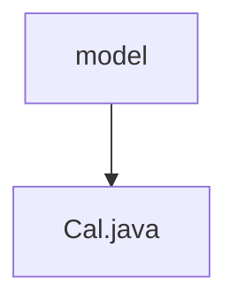

# 基础信息

|      |      |
|------|------|
| 名称 | model |
| 编码语言 | .java |
| 代码路径 | staffjoy/ical-svc/src/main/java/xyz/staffjoy/ical/model |
| 包名 | staffjoy.docs.ical-svc.src.main.java.xyz.staffjoy.ical.model |
| 概述说明 | Cal类生成iCal格式日程，包含公司名和班次列表，支持构建完整日程内容。 |

# 说明

这是一个用于生成iCalendar格式数据的Java类。类名为Cal，包含公司名称和班次列表两个属性。定义了日期格式常量和格式化器，提供将Instant对象格式化为字符串的方法。类包含生成iCalendar头部、主体和尾部的方法：头部包含固定协议信息；主体遍历班次列表，为每个班次生成包含组织者、摘要、唯一标识、状态、起止时间等字段的事件块；尾部为固定结束标记。最后提供build方法拼接三部分内容生成完整iCalendar数据。类使用了Lombok注解简化代码，支持全参、无参构造器和建造者模式。

### 包内部结构视图

该流程图展示了ical-svc项目中model目录与Cal.java文件的层级关系。model作为父目录包含唯一的子节点Cal.java文件，结构简洁明了。这是典型的Java项目结构，其中model目录用于存放数据模型类，而Cal.java可能是处理日历相关逻辑的核心类文件。整个结构符合MVC设计模式中模型层的组织方式。

# 文件列表 File List

| 名称   | 类型  | 说明 |
|-------|------|-------------|
| [Cal.java](Cal.md) | file | Cal类生成iCal格式日程，包含公司名和班次列表，支持构建完整日程内容。 |

