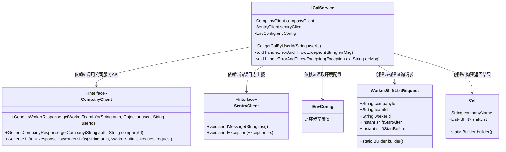
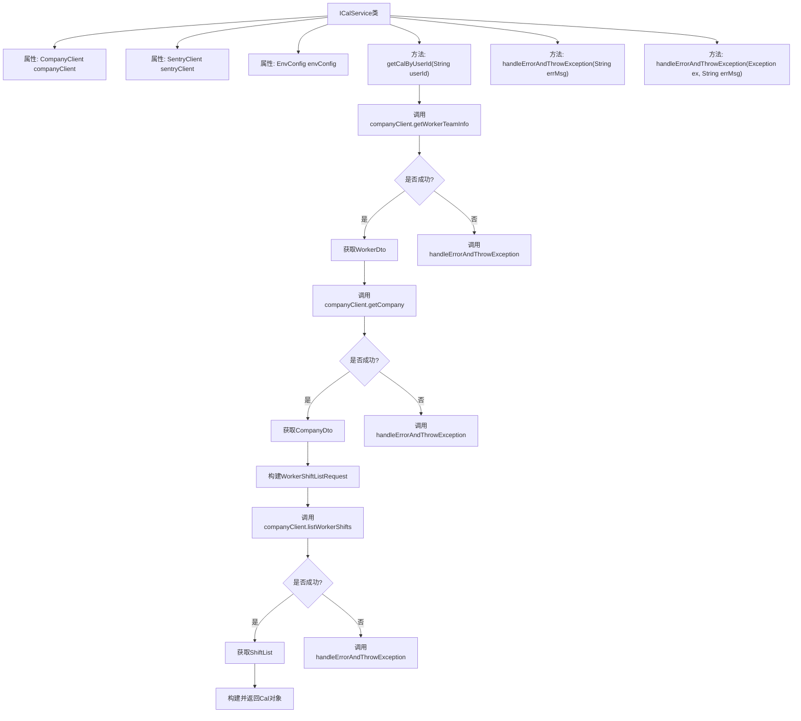
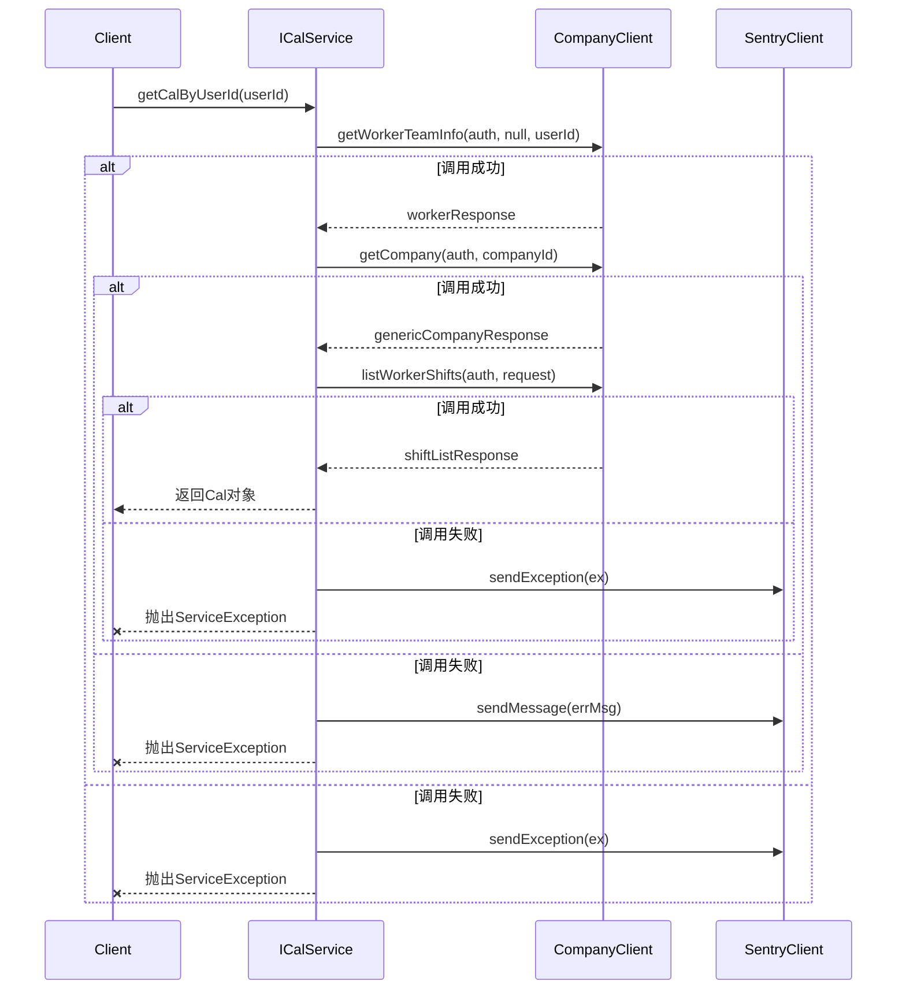

# 基础信息

|      |      |
|------|------|
| 名称 | ICalService |
| 编码语言 | .java |
| 代码路径 | staffjoy/ical-svc/src/main/java/xyz/staffjoy/ical/service/ICalService.java |
| 包名 | xyz.staffjoy.ical.service |
| 依赖项 | ['com.github.structlog4j.ILogger', 'com.github.structlog4j.SLoggerFactory', 'io.sentry.SentryClient', 'org.springframework.beans.factory.annotation.Autowired', 'org.springframework.stereotype.Service', 'xyz.staffjoy.common.auth.AuthConstant', 'xyz.staffjoy.common.env.EnvConfig', 'xyz.staffjoy.common.error.ServiceException', 'xyz.staffjoy.company.client.CompanyClient', 'xyz.staffjoy.company.dto', 'xyz.staffjoy.ical.model.Cal', 'java.time.Instant', 'java.time.temporal.ChronoUnit'] |
| 概述说明 | ICalService类通过公司客户端获取用户团队、公司及班次信息，构建Cal对象返回。异常时记录日志并抛出。 |

# 说明

ICalService是一个Spring服务类，用于获取用户相关的日历信息。它通过CompanyClient获取用户团队信息、公司信息和排班列表，并构建包含公司名称和排班列表的Cal对象。过程中会捕获异常并记录日志，通过SentryClient上报错误，最后抛出ServiceException。服务依赖EnvConfig配置，使用静态日志记录器。

# 类列表 Class Summary

| 名称   | 类型  | 说明 |
|-------|------|-------------|
| ICalService | class | ICalService通过公司客户端获取用户团队、公司及班次信息，构建Cal对象返回。异常时记录日志并抛出。 |

## 类 ICalService

|      |      |
|------|------|
| 访问范围 | @Service;public |
| 类型 | class |
| 名称 | ICalService |
| 说明 | ICalService通过公司客户端获取用户团队、公司及班次信息，构建Cal对象返回。异常时记录日志并抛出。 |

### UML类图

该类图展示了ICalService的核心结构和依赖关系。ICalService通过CompanyClient获取员工团队信息、公司数据和排班列表，使用SentryClient进行错误上报，最终构建包含公司名称和排班列表的Cal对象返回。图中清晰体现了服务层与外部接口的交互方式，包括WorkerShiftListRequest请求对象的构建和Cal结果对象的组装过程，以及统一的异常处理机制。

### 内部方法调用关系图

这段代码是ICalService类的实现，主要功能是通过用户ID获取日历信息。流程包括：1)获取员工团队信息；2)获取公司信息；3)获取员工排班列表；4)构建日历对象返回。整个过程有完善的错误处理机制，任何步骤失败都会记录日志并抛出异常。时序图展示了客户端调用服务、服务调用公司客户端、错误处理等完整交互流程。

### 字段列表 Field List

| 名称  | 类型  | 说明 |
|-------|-------|------|
| logger = SLoggerFactory.getLogger(ICalService.class) | ILogger | 静态日志记录器实例，用于ICalService类。 |
| companyClient | CompanyClient | 自动注入公司客户端实例 |
| envConfig | EnvConfig | 自动注入环境配置对象envConfig。 |
| sentryClient | SentryClient | 自动注入SentryClient实例。 |

### 方法列表 Method List

| 名称  | 类型  | 说明 |
|-------|-------|------|
| getCalByUserId | Cal | 通过用户ID获取团队、公司和排班信息，构建并返回日历对象。 |
| handleErrorAndThrowException | void | 处理错误并抛出异常：记录日志、发送至Sentry、抛出ServiceException。 |
| handleErrorAndThrowException | void | 处理错误并抛出异常：记录日志、发送至Sentry、抛出服务异常。 |

