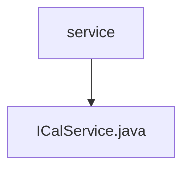

# 基础信息

|      |      |
|------|------|
| 名称 | service |
| 编码语言 | .java |
| 代码路径 | staffjoy/ical-svc/src/main/java/xyz/staffjoy/ical/service |
| 包名 | staffjoy.docs.ical-svc.src.main.java.xyz.staffjoy.ical.service |
| 概述说明 | ICalService类通过公司客户端获取用户团队、公司及班次信息，构建Cal对象返回。异常时记录日志并抛出。 |

# 说明

ICalService是一个Spring服务类，用于获取用户相关的日历信息。它通过CompanyClient获取用户团队信息、公司信息和排班列表，并构建包含公司名称和排班列表的Cal对象。过程中会捕获异常并记录日志，通过SentryClient上报错误，最后抛出ServiceException。服务依赖EnvConfig配置，使用静态日志记录器。

### 包内部结构视图

该流程图展示了ICalService.java文件与service目录之间的层级关系。service作为父目录节点，ICalService.java作为其子节点，表示该Java文件位于service目录下。这种结构常见于微服务架构中，其中service目录通常包含核心服务实现类，而ICalService.java可能负责处理与iCalendar相关的业务逻辑。整个结构简洁明了，符合典型的Java项目包组织规范。

# 文件列表 File List

| 名称   | 类型  | 说明 |
|-------|------|-------------|
| [ICalService.java](ICalService.md) | file | ICalService类通过公司客户端获取用户团队、公司及班次信息，构建Cal对象返回。异常时记录日志并抛出。 |

