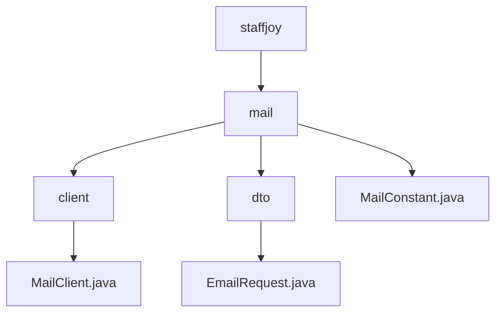

# 基础信息

|      |      |
|------|------|
| 名称 | staffjoy |
| 编码语言 | .java |
| 代码路径 | staffjoy/mail-api/src/main/java/xyz/staffjoy |
| 包名 | staffjoy.docs.mail-api.src.main.java.xyz.staffjoy |
| 概述说明 | Spring Cloud Feign邮件客户端接口，定义发送邮件POST方法，使用EmailRequest封装请求数据，MailConstant管理服务配置。 |

# 说明

## 概述
该代码模块是一个基于Spring Cloud Feign实现的邮件服务客户端模块，主要用于与邮件微服务进行交互，实现邮件发送功能。模块包含三个核心组件：Feign客户端接口、邮件请求数据传输对象(DTO)和邮件服务常量定义。通过标准化接口和统一配置，为系统其他模块提供简洁的邮件服务调用方式。

## 主要业务场景
1. **邮件发送服务调用**：通过Feign客户端接口(`@FeignClient`)声明远程服务调用，其他服务可以通过该接口直接调用邮件服务的发送功能，无需关注底层HTTP通信细节。
2. **邮件请求数据封装**：使用`EmailRequest` DTO对象规范邮件发送请求参数，包含收件人邮箱、邮件主题、HTML正文等必要信息，并通过校验注解确保数据完整性。
3. **统一配置管理**：通过`MailConstant`集中管理邮件服务相关的静态配置，包括服务名称、发件人信息、公司邮箱后缀等，避免硬编码和配置分散。
4. **标准化服务交互**：采用统一的请求/响应模型(如`BaseResponse`)进行服务间通信，保证接口一致性。

典型使用场景包括系统通知邮件发送、用户注册验证邮件、密码重置邮件等需要邮件服务的业务场景。

### 包内部结构视图

该流程图展示了staffjoy项目中mail模块的代码结构。mail作为根目录包含三个子节点：client目录（包含MailClient.java实现类）、dto目录（包含EmailRequest.java数据传输对象）以及MailConstant.java常量文件。这种层级关系清晰地反映了邮件服务API的模块化设计，各组件职责分明。

# 文件列表 File List

| 名称   | 类型  | 说明 |
|-------|------|-------------|
| [mail](mail/_module.md) | package | Spring Cloud Feign邮件客户端接口，定义发送邮件POST方法，使用EmailRequest封装请求数据，MailConstant管理服务配置。 |

