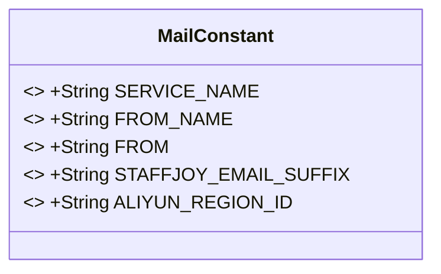
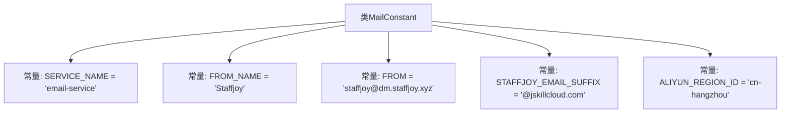

# 基础信息

|      |      |
|------|------|
| 名称 | MailConstant |
| 编码语言 | .java |
| 代码路径 | staffjoy/mail-api/src/main/java/xyz/staffjoy/mail/MailConstant.java |
| 包名 | xyz.staffjoy.mail |
| 依赖项 | [] |
| 概述说明 | 邮件服务常量类，含服务名、发件人、阿里云区域ID等信息。 |

# 说明

这是一个名为MailConstant的Java公共类，包含邮件服务相关的静态常量定义。其中定义了服务名称为email-service，发件人名称为Staffjoy，发件邮箱为staffjoy@dm.staffjoy.xyz，公司邮箱后缀为@jskillcloud.com，以及阿里云区域ID为cn-hangzhou。这些常量用于统一管理邮件服务的配置信息。

# 类列表 Class Summary

| 名称   | 类型  | 说明 |
|-------|------|-------------|
| MailConstant | class | 邮件服务常量类，包含发件人、服务名、域名后缀和阿里云区域ID。 |

## 类 MailConstant

|      |      |
|------|------|
| 访问范围 | public |
| 类型 | class |
| 名称 | MailConstant |
| 说明 | 邮件服务常量类，包含发件人、服务名、域名后缀和阿里云区域ID。 |

### UML类图

该类图展示了一个包含邮件服务常量的工具类MailConstant，所有字段均为公有静态常量。主要包含服务名称(SERVICE_NAME)、发件人信息(FROM_NAME/FROM)、邮箱后缀(STAFFJOY_EMAIL_SUFFIX)和阿里云区域ID(ALIYUN_REGION_ID)等配置参数。这些常量被标记为final表示不可修改，用于集中管理邮件服务相关的固定配置值，便于系统统一维护和使用。

### 内部方法调用关系图

这段代码定义了一个名为MailConstant的类，其中包含了五个静态常量字符串，分别用于存储邮件服务的名称、发件人名称、发件人邮箱地址、邮箱后缀以及阿里云的区域ID。这些常量在整个邮件服务中被引用，确保配置的一致性和可维护性。由于所有字段都是静态且不可变的，因此该类主要用于集中管理邮件相关的配置信息。

### 字段列表 Field List

| 名称  | 类型  | 说明 |
|-------|-------|------|
| ALIYUN_REGION_ID = "cn-hangzhou" | String | 阿里云区域ID设为杭州 |
| FROM_NAME = "Staffjoy" | String | 静态常量FROM_NAME值为"Staffjoy"。 |
| SERVICE_NAME = "email-service" | String | 定义常量SERVICE_NAME，值为"email-service"。 |
| FROM = "staffjoy@dm.staffjoy.xyz" | String | 邮件发件人为staffjoy@dm.staffjoy.xyz |
| STAFFJOY_EMAIL_SUFFIX = "@jskillcloud.com" | String | 员工邮箱后缀为@jskillcloud.com |

### 方法列表 Method List

| 名称  | 类型  | 说明 |
|-------|-------|------|

