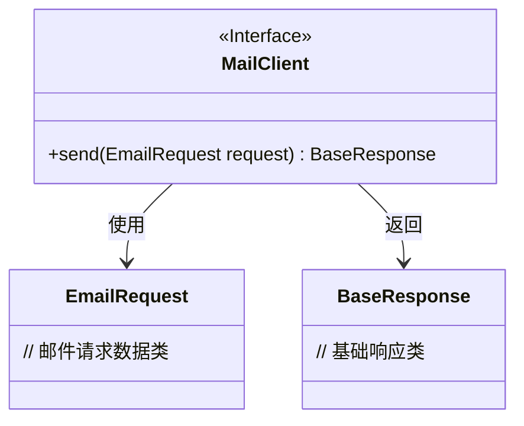
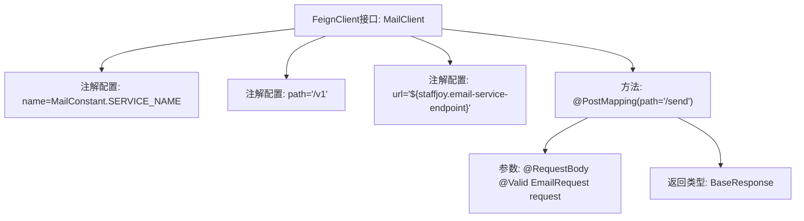

# 基础信息

|      |      |
|------|------|
| 名称 | MailClient |
| 编码语言 | .java |
| 代码路径 | staffjoy/mail-api/src/main/java/xyz/staffjoy/mail/client/MailClient.java |
| 包名 | xyz.staffjoy.mail.client |
| 依赖项 | ['org.springframework.cloud.openfeign.FeignClient', 'org.springframework.web.bind.annotation.PostMapping', 'org.springframework.web.bind.annotation.RequestBody', 'xyz.staffjoy.common.api.BaseResponse', 'xyz.staffjoy.mail.MailConstant', 'xyz.staffjoy.mail.dto.EmailRequest', 'javax.validation.Valid'] |
| 概述说明 | Feign客户端接口MailClient，调用邮件服务发送邮件。 |

# 说明

这是一个使用Spring Cloud Feign的邮件服务客户端接口定义。该接口通过@FeignClient注解声明为远程服务客户端，指定了服务名称为MailConstant.SERVICE_NAME，基础路径为"/v1"，并通过配置项staffjoy.email-service-endpoint获取服务地址。接口中定义了一个POST请求方法send，路径为"/send"，接收一个经过验证的EmailRequest对象作为请求体，返回BaseResponse类型响应。该客户端用于与邮件服务进行HTTP交互，实现邮件发送功能。

# 类列表 Class Summary

| 名称   | 类型  | 说明 |
|-------|------|-------------|
| MailClient | interface | Feign客户端接口MailClient，调用邮件服务发送邮件。 |

## 类 MailClient

|      |      |
|------|------|
| 访问范围 | @FeignClient(name = MailConstant.SERVICE_NAME, path = "/v1", url = "${staffjoy.email-service-endpoint}");public |
| 类型 | interface |
| 名称 | MailClient |
| 说明 | Feign客户端接口MailClient，调用邮件服务发送邮件。 |

### UML类图

这段代码描述了一个基于Feign客户端的邮件服务接口MailClient，该接口通过HTTP POST请求发送邮件。MailClient是一个标注了@FeignClient的Spring Cloud接口，指向名为MailConstant.SERVICE_NAME的微服务，基础路径为"/v1"，服务地址通过配置项staffjoy.email-service-endpoint注入。接口中定义了send方法，接收经过验证的EmailRequest对象作为请求体，返回BaseResponse类型响应。类图展示了MailClient接口与EmailRequest、BaseResponse两个数据类之间的依赖关系。

### 内部方法调用关系图

这段代码定义了一个Feign客户端接口MailClient，用于邮件服务远程调用。通过@FeignClient注解配置了服务名称、基础路径和动态URL端点，包含一个发送邮件的POST方法，接收验证过的EmailRequest参数并返回BaseResponse。流程图展示了接口的注解配置与方法定义的层级关系，突出了Spring Cloud Feign的核心元素和请求映射结构。

### 字段列表 Field List

| 名称  | 类型  | 说明 |
|-------|-------|------|

### 方法列表 Method List

| 名称  | 类型  | 说明 |
|-------|-------|------|
| send | BaseResponse | 定义发送邮件的POST接口，接收验证过的请求体。 |

