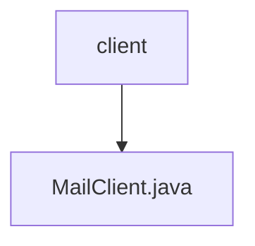

# 基础信息

|      |      |
|------|------|
| 名称 | client |
| 编码语言 | .java |
| 代码路径 | staffjoy/mail-api/src/main/java/xyz/staffjoy/mail/client |
| 包名 | staffjoy.docs.mail-api.src.main.java.xyz.staffjoy.mail.client |
| 概述说明 | Feign客户端接口MailClient，调用邮件服务发送邮件。 |

# 说明

这是一个使用Spring Cloud Feign的邮件服务客户端接口定义。该接口通过@FeignClient注解声明为远程服务客户端，指定了服务名称为MailConstant.SERVICE_NAME，基础路径为"/v1"，并通过配置项staffjoy.email-service-endpoint获取服务地址。接口中定义了一个POST请求方法send，路径为"/send"，接收一个经过验证的EmailRequest对象作为请求体，返回BaseResponse类型响应。该客户端用于与邮件服务进行HTTP交互，实现邮件发送功能。

### 包内部结构视图

该流程图展示了mail-api模块中邮件服务客户端的结构关系。顶层节点为client目录，其下包含一个具体的邮件客户端实现文件MailClient.java。这种结构体现了典型客户端接口与实现文件的层级关系，符合Java项目标准目录规范。

# 文件列表 File List

| 名称   | 类型  | 说明 |
|-------|------|-------------|
| [MailClient.java](MailClient.md) | file | Feign客户端接口MailClient，调用邮件服务发送邮件。 |

