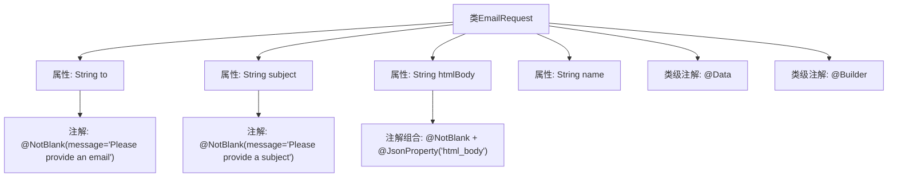

# 基础信息

|      |      |
|------|------|
| 名称 | EmailRequest |
| 编码语言 | .java |
| 代码路径 | staffjoy/mail-api/src/main/java/xyz/staffjoy/mail/dto/EmailRequest.java |
| 包名 | xyz.staffjoy.mail.dto |
| 依赖项 | ['com.fasterxml.jackson.annotation.JsonProperty', 'lombok.Builder', 'lombok.Data', 'javax.validation.constraints.NotBlank'] |
| 概述说明 | EmailRequest类：含收件人、主题、正文和姓名字段，使用Builder模式构建。 |

# 说明

这是一个名为EmailRequest的Java类，用于封装电子邮件请求数据。类使用了@Data和@Builder注解，支持自动生成getter/setter和构建器模式。包含四个字段：to（收件人邮箱，非空校验）、subject（邮件主题，非空校验）、htmlBody（HTML格式邮件正文，非空校验，JSON属性名为html_body）和name（发件人名称，可为空）。每个非空字段都配置了校验失败时的提示信息。

# 类列表 Class Summary

| 名称   | 类型  | 说明 |
|-------|------|-------------|
| EmailRequest | class | EmailRequest类：包含必填字段to、subject、htmlBody和可选字段name。 |


## 类 EmailRequest

|      |      |
|------|------|
| 访问范围 | @Data;@Builder;public |
| 类型 | class |
| 名称 | EmailRequest |
| 说明 | EmailRequest类：包含必填字段to、subject、htmlBody和可选字段name。 |


### UML类图

```mermaid
classDiagram
    class EmailRequest {
        -String to
        -String subject
        -String htmlBody
        -String name
        +String getTo()
        +void setTo(String to)
        +String getSubject()
        +void setSubject(String subject)
        +String getHtmlBody()
        +void setHtmlBody(String htmlBody)
        +String getName()
        +void setName(String name)
        +EmailRequestBuilder builder()
    }
    // @Data注解生成getter/setter方法
    // @Builder注解生成builder模式构造器
    // @NotBlank和@JsonProperty为字段验证和序列化标记
```

这段类图展示了一个邮件请求实体类EmailRequest，包含四个核心字段：收件人地址(to)、邮件主题(subject)、HTML格式内容(htmlBody)和发件人名称(name)。类通过Lombok的@Data注解自动生成所有字段的getter/setter方法，并通过@Builder提供链式构造支持。字段上的@NotBlank注解实现参数校验，@JsonProperty则指定JSON序列化时的字段映射关系。该设计适用于邮件发送服务的请求参数封装，兼顾数据验证与灵活构建能力。


### 内部方法调用关系图



这段代码定义了一个使用Lombok注解的EmailRequest类，包含邮件接收方(to)、主题(subject)、HTML内容(htmlBody)和发件人姓名(name)四个属性。通过@Data自动生成getter/setter，@Builder提供建造者模式，关键字段使用@NotBlank进行非空校验，htmlBody字段通过@JsonProperty实现JSON序列化别名映射。流程图清晰展示了类结构与注解的层级关系。

### 字段列表 Field List

| 名称  | 类型  | 说明 |
|-------|-------|------|
| to | String | 非空邮箱字段校验 |
| subject | String | 非空验证：subject字段不能为空。 |
| htmlBody | String | 非空HTML内容字段，属性名为htmlBody。 |
| name | String | 私有字符串变量name |

### 方法列表 Method List

| 名称  | 类型  | 说明 |
|-------|-------|------|


