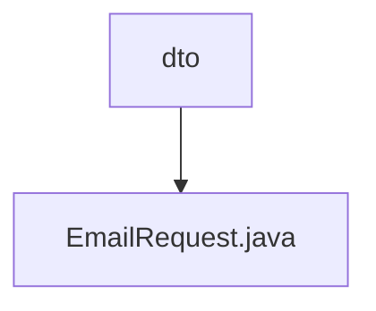

# 基础信息

|      |      |
|------|------|
| 名称 | dto |
| 编码语言 | .java |
| 代码路径 | staffjoy/mail-api/src/main/java/xyz/staffjoy/mail/dto |
| 包名 | staffjoy.docs.mail-api.src.main.java.xyz.staffjoy.mail.dto |
| 概述说明 | EmailRequest类：含收件人、主题、正文和姓名字段，使用Builder模式构建。 |

# 说明

这是一个名为EmailRequest的Java类，用于封装电子邮件请求数据。类使用了@Data和@Builder注解，支持自动生成getter/setter和构建器模式。包含四个字段：to（收件人邮箱，非空校验）、subject（邮件主题，非空校验）、htmlBody（HTML格式邮件正文，非空校验，JSON属性名为html_body）和name（发件人名称，可为空）。每个非空字段都配置了校验失败时的提示信息。

### 包内部结构视图

该流程图展示了mail-api项目中邮件服务的数据传输对象结构。根节点为dto目录，包含一个具体的EmailRequest.java文件，用于处理邮件发送请求。这种结构体现了典型的DTO模式应用，将邮件请求参数封装为独立对象，便于接口传输和反序列化操作。

# 文件列表 File List

| 名称   | 类型  | 说明 |
|-------|------|-------------|
| [EmailRequest.java](EmailRequest.md) | file | EmailRequest类：含收件人、主题、正文和姓名字段，使用Builder模式构建。 |

