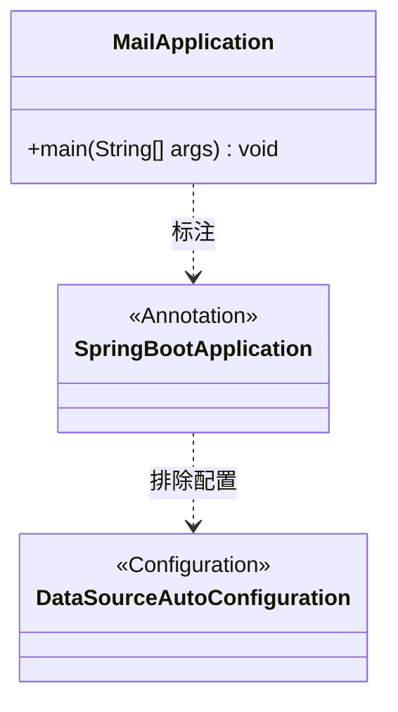
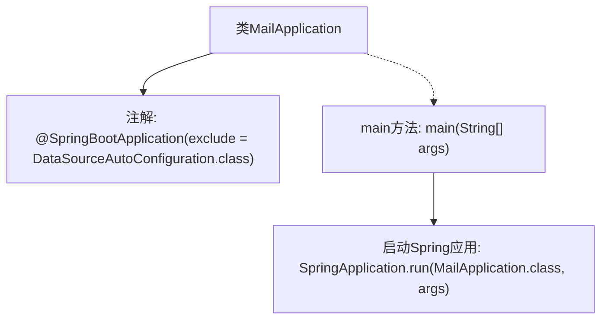

# 基础信息

|      |      |
|------|------|
| 名称 | MailApplication |
| 编码语言 | .java |
| 代码路径 | staffjoy/mail-svc/src/main/java/xyz/staffjoy/mail/MailApplication.java |
| 包名 | xyz.staffjoy.mail |
| 依赖项 | ['org.springframework.boot.SpringApplication', 'org.springframework.boot.autoconfigure.SpringBootApplication', 'org.springframework.boot.autoconfigure.jdbc.DataSourceAutoConfiguration'] |
| 概述说明 | SpringBoot应用排除数据源配置，启动MailApplication。 |

# 说明

这是一个基于Spring Boot框架的邮件应用程序主类。类上标注了@SpringBootApplication注解，表示这是一个Spring Boot应用入口，并通过exclude参数排除了DataSourceAutoConfiguration自动配置。主类包含标准的main方法，通过SpringApplication.run启动应用程序。整个结构表明这是一个不依赖数据库的独立邮件服务应用。

# 类列表 Class Summary

| 名称   | 类型  | 说明 |
|-------|------|-------------|
| MailApplication | class | SpringBoot应用排除数据源配置，启动MailApplication。 |

## 类 MailApplication

|      |      |
|------|------|
| 访问范围 | @SpringBootApplication(exclude = {DataSourceAutoConfiguration.class});public |
| 类型 | class |
| 名称 | MailApplication |
| 说明 | SpringBoot应用排除数据源配置，启动MailApplication。 |

### UML类图

这段类图展示了Spring Boot邮件应用的启动类结构。MailApplication作为主类使用@SpringBootApplication注解进行标记，并明确排除了DataSourceAutoConfiguration自动配置类。该注解表明这是一个Spring Boot应用入口，同时通过exclude参数禁用了数据源自动配置功能，适用于不需要数据库连接的纯邮件服务场景。图中清晰呈现了注解与配置类之间的排除关系。

### 内部方法调用关系图

这段流程图展示了MailApplication类的核心结构。类通过@SpringBootApplication注解排除了数据源自动配置，main方法作为程序入口调用SpringApplication.run启动Spring Boot应用。该图清晰地反映了Spring Boot应用的启动流程，从类定义到容器初始化的关键步骤，突出了自动配置排除和运行上下文的核心逻辑。

### 字段列表 Field List

| 名称  | 类型  | 说明 |
|-------|-------|------|

### 方法列表 Method List

| 名称  | 类型  | 说明 |
|-------|-------|------|
| main | void | Java主方法启动Spring应用MailApplication。 |

