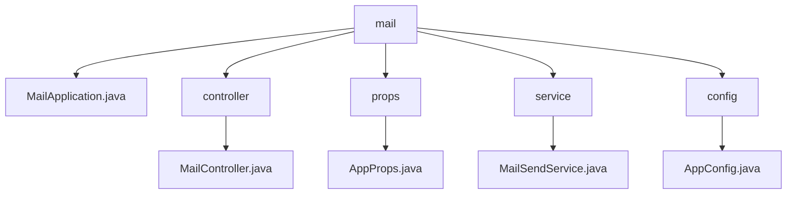

# 基础信息

|      |      |
|------|------|
| 名称 | mail |
| 编码语言 | .java |
| 代码路径 | staffjoy/mail-svc/src/main/java/xyz/staffjoy/mail |
| 包名 | staffjoy.docs.mail-svc.src.main.java.xyz.staffjoy.mail |
| 概述说明 | MailController处理邮件发送请求，AppProps存储阿里云密钥，MailSendService异步发送邮件并记录日志，AppConfig配置异步任务和阿里云客户端，MailApplication是Spring Boot入口。 |

# 说明

# 邮件服务模块总结

## 概述
该模块是一个基于Spring Boot框架构建的独立邮件服务系统，主要功能是通过阿里云邮件服务API实现异步邮件发送。模块采用RESTful接口设计，支持参数校验和异步处理，具有环境感知能力（区分生产/非生产环境）和异常监控功能（集成Sentry）。服务不依赖数据库，是一个轻量级的独立微服务。

## 主要业务场景
1. **邮件发送服务**：
   - 提供`/v1/send` REST接口接收邮件发送请求
   - 支持异步邮件发送处理，避免阻塞主线程
   - 自动处理阿里云邮件服务API调用

2. **环境适配处理**：
   - 在非生产环境自动拦截非jskillcloud.com后缀的收件地址
   - 在邮件主题前自动添加环境标识（dev/uat）

3. **监控与日志**：
   - 详细记录邮件发送日志（主题、收件人、内容）
   - 发送失败时自动上报异常到Sentry监控系统
   - 通过ILogger实现规范的日志输出

4. **配置管理**：
   - 集中管理阿里云服务访问密钥（accessKey/secret）
   - 配置专用线程池处理异步任务（核心线程3，最大线程5）
   - 支持通过`staffjoy`前缀的配置属性注入

### 包内部结构视图

该流程图展示了mail模块的层级结构，根节点为mail目录，包含五个子节点：MailApplication.java应用入口文件、controller控制器目录、props配置属性目录、service服务目录和config配置目录。每个子目录下分别包含对应的实现文件：控制器包含MailController.java，属性配置包含AppProps.java，服务层包含MailSendService.java，配置层包含AppConfig.java。整体结构清晰展现了典型的Spring Boot应用分层架构。

# 文件列表 File List

| 名称   | 类型  | 说明 |
|-------|------|-------------|
| [MailApplication.java](MailApplication.md) | file | SpringBoot应用排除数据源配置，启动MailApplication。 |
| [config](config/_module.md) | package | 配置类启用异步，定义阿里云客户端和线程池执行器。 |
| [service](service/_module.md) | package | 邮件发送服务类，支持异步发送，非生产环境仅限内部邮箱，记录日志和异常。 |
| [props](props/_module.md) | package | Java配置类，含阿里云邮件密钥参数。 |
| [controller](controller/_module.md) | package | Java邮件发送控制器，异步处理请求并返回响应。 |

