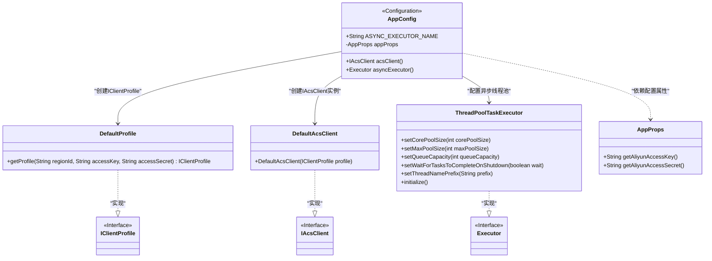
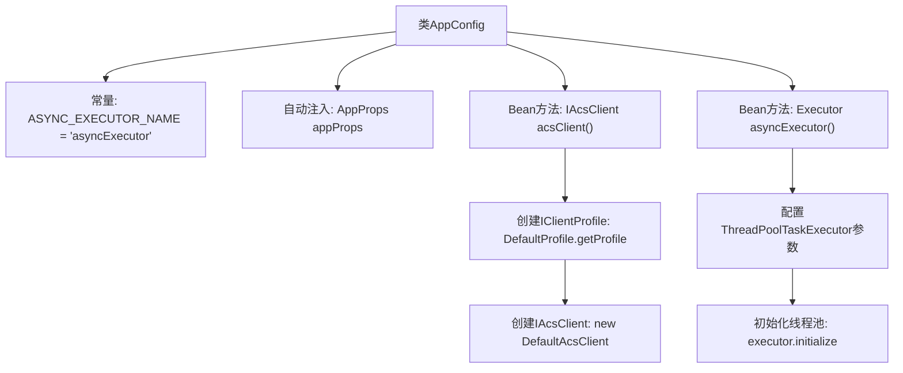

# 基础信息

|      |      |
|------|------|
| 名称 | AppConfig |
| 编码语言 | .java |
| 代码路径 | staffjoy/mail-svc/src/main/java/xyz/staffjoy/mail/config/AppConfig.java |
| 包名 | xyz.staffjoy.mail.config |
| 依赖项 | ['com.aliyuncs.DefaultAcsClient', 'com.aliyuncs.IAcsClient', 'com.aliyuncs.profile.DefaultProfile', 'com.aliyuncs.profile.IClientProfile', 'org.springframework.context.annotation.Import', 'org.springframework.scheduling.concurrent.ThreadPoolTaskExecutor', 'xyz.staffjoy.common.config.StaffjoyRestConfig', 'xyz.staffjoy.mail.MailConstant', 'xyz.staffjoy.mail.props.AppProps', 'org.springframework.beans.factory.annotation.Autowired', 'org.springframework.context.annotation.Bean', 'org.springframework.context.annotation.Configuration', 'org.springframework.scheduling.annotation.EnableAsync', 'java.util.concurrent.Executor'] |
| 概述说明 | 配置类启用异步，定义阿里云客户端和线程池执行器。 |

# 说明

这是一个名为AppConfig的Java配置类，主要用于应用配置和异步任务管理。类上标注了@Configuration和@EnableAsync注解，表示这是一个配置类并启用了异步功能。它导入了StaffjoyRestConfig类，并定义了两个Bean：一个是用于阿里云服务的IAcsClient客户端，使用应用属性中的访问密钥进行配置；另一个是名为asyncExecutor的线程池执行器，设置了核心线程数3、最大线程数5、队列容量100等参数，并配置了线程名前缀和关闭时等待任务完成的特性。类中还定义了一个常量ASYNC_EXECUTOR_NAME用于标识异步执行器。

# 类列表 Class Summary

| 名称   | 类型  | 说明 |
|-------|------|-------------|
| AppConfig | class | 应用配置类，启用异步并导入其他配置，定义阿里云客户端和异步线程池。 |

## 类 AppConfig

|      |      |
|------|------|
| 访问范围 | @Configuration;@EnableAsync;@Import(value = StaffjoyRestConfig.class);@SuppressWarnings(value = "Duplicates");public |
| 类型 | class |
| 名称 | AppConfig |
| 说明 | 应用配置类，启用异步并导入其他配置，定义阿里云客户端和异步线程池。 |

### UML类图

这段代码是一个Spring配置类AppConfig，主要功能包括：1) 通过@EnableAsync启用异步支持；2) 创建阿里云邮件服务的IAcsClient客户端；3) 配置名为"asyncExecutor"的线程池任务执行器。类图展示了AppConfig与多个组件的关系，包括依赖阿里云SDK的DefaultProfile/DefaultAcsClient、线程池实现ThreadPoolTaskExecutor，以及配置属性类AppProps。所有组件通过Spring的依赖注入机制进行组装，核心是构建可用的异步邮件发送环境。

### 内部方法调用关系图

这段代码是一个Spring配置类AppConfig，主要完成两个核心功能：1) 创建阿里云ACS客户端Bean，通过读取配置的密钥信息构建IClientProfile并初始化IAcsClient；2) 配置异步线程池Bean，设置核心线程数、最大线程数、队列容量等参数，并指定线程名前缀。类通过@EnableAsync启用异步支持，并导入StaffjoyRestConfig配置，整个流程展现了Spring容器初始化时如何构建这两个关键组件。

### 字段列表 Field List

| 名称  | 类型  | 说明 |
|-------|-------|------|
| ASYNC_EXECUTOR_NAME = "asyncExecutor" | String | 异步执行器名称定义为asyncExecutor。 |
| appProps | AppProps | 自动注入AppProps配置属性 |

### 方法列表 Method List

| 名称  | 类型  | 说明 |
|-------|-------|------|
| acsClient | IAcsClient | 创建阿里云ACS客户端实例，使用默认配置和密钥。 |
| asyncExecutor | Executor | 创建异步线程池，核心3线程，最大5线程，队列100任务，关闭等待完成，线程名前缀AsyncThread-。 |

