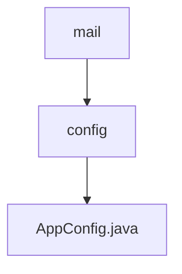

# 基础信息

|      |      |
|------|------|
| 名称 | config |
| 编码语言 | .java |
| 代码路径 | staffjoy/mail-svc/src/main/java/xyz/staffjoy/mail/config |
| 包名 | staffjoy.docs.mail-svc.src.main.java.xyz.staffjoy.mail.config |
| 概述说明 | 配置类启用异步，定义阿里云客户端和线程池执行器。 |

# 说明

这是一个名为AppConfig的Java配置类，主要用于应用配置和异步任务管理。类上标注了@Configuration和@EnableAsync注解，表示这是一个配置类并启用了异步功能。它导入了StaffjoyRestConfig类，并定义了两个Bean：一个是用于阿里云服务的IAcsClient客户端，使用应用属性中的访问密钥进行配置；另一个是名为asyncExecutor的线程池执行器，设置了核心线程数3、最大线程数5、队列容量100等参数，并配置了线程名前缀和关闭时等待任务完成的特性。类中还定义了一个常量ASYNC_EXECUTOR_NAME用于标识异步执行器。

### 包内部结构视图

该流程图展示了mail服务中config目录的层级结构，顶层为mail模块，其下包含config配置目录，该目录中存放着AppConfig.java应用程序配置文件。这种结构清晰地反映了Spring Boot项目中典型的配置类存放方式，符合Maven标准目录布局规范。

# 文件列表 File List

| 名称   | 类型  | 说明 |
|-------|------|-------------|
| [AppConfig.java](AppConfig.md) | file | 配置类启用异步，定义阿里云客户端和线程池执行器。 |

