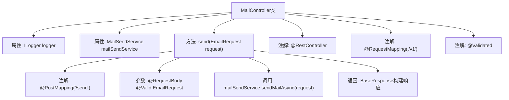
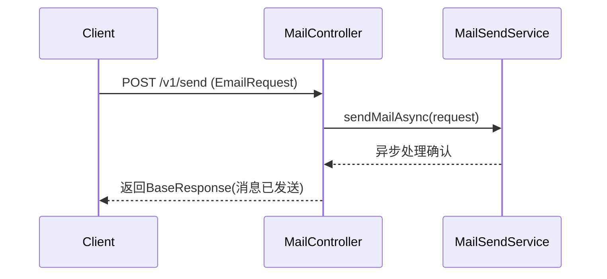

# 基础信息

|      |      |
|------|------|
| 名称 | MailController |
| 编码语言 | .java |
| 代码路径 | staffjoy/mail-svc/src/main/java/xyz/staffjoy/mail/controller/MailController.java |
| 包名 | xyz.staffjoy.mail.controller |
| 依赖项 | ['com.github.structlog4j.ILogger', 'com.github.structlog4j.SLoggerFactory', 'org.springframework.beans.factory.annotation.Autowired', 'org.springframework.validation.annotation.Validated', 'org.springframework.web.bind.annotation', 'xyz.staffjoy.common.api.BaseResponse', 'xyz.staffjoy.mail.dto.EmailRequest', 'xyz.staffjoy.mail.service.MailSendService', 'javax.validation.Valid'] |
| 概述说明 | Java邮件发送控制器，异步处理请求并返回响应。 |

# 说明

这是一个名为MailController的Spring Boot REST控制器类，位于/v1路径下。该类使用@Validated注解启用参数校验，并自动装配了MailSendService服务。控制器包含一个POST方法/send，接收经过校验的EmailRequest请求体，异步调用mailSendService的sendMailAsync方法发送邮件，返回包含异步发送提示信息的BaseResponse响应对象。类中还定义了ILogger类型的日志记录器用于日志输出。

# 类列表 Class Summary

| 名称   | 类型  | 说明 |
|-------|------|-------------|
| MailController | class | 邮件控制器类，提供异步发送邮件的API接口。 |


## 类 MailController

|      |      |
|------|------|
| 访问范围 | @RestController;@RequestMapping("/v1");@Validated;public |
| 类型 | class |
| 名称 | MailController |
| 说明 | 邮件控制器类，提供异步发送邮件的API接口。 |


### UML类图

```mermaid
classDiagram
    class MailController {
        -ILogger logger
        -MailSendService mailSendService
        +send(EmailRequest request) BaseResponse
    }
    <<Interface>> ILogger
    class MailSendService {
        +sendMailAsync(EmailRequest request) void
    }
    class EmailRequest {
        // 邮件请求DTO
    }
    class BaseResponse {
        // 基础响应类
    }
    MailController --> MailSendService : 依赖
    MailController --> EmailRequest : 使用
    MailController --> BaseResponse : 返回
    MailController ..> ILogger : 日志记录
```

该类图展示了Spring Boot中一个邮件发送控制器MailController的结构，它依赖MailSendService进行异步邮件发送，使用EmailRequest作为请求体，返回BaseResponse响应。控制器通过ILogger接口记录日志，体现了典型的RESTful API分层设计模式，包含服务调用、参数校验和响应构建等核心功能。


### 内部方法调用关系图





这段代码实现了一个邮件发送的REST接口，采用Spring Boot框架构建。流程图展示了MailController类的结构，包含日志组件和邮件服务依赖注入，以及带有参数验证的send方法。时序图描述了客户端请求通过控制器异步调用邮件服务的过程，最终返回操作结果。代码通过@Validated和@Valid实现参数校验，采用builder模式构建响应，体现了清晰的职责分离和异步处理设计。

### 字段列表 Field List

| 名称  | 类型  | 说明 |
|-------|-------|------|
| mailSendService | MailSendService | 自动注入邮件发送服务 |
| logger = SLoggerFactory.getLogger(MailController.class) | ILogger | 私有静态日志记录器，用于MailController类。 |

### 方法列表 Method List

| 名称  | 类型  | 说明 |
|-------|-------|------|
| send | BaseResponse | 接口路径/send，异步发送邮件，返回成功信息。 |


