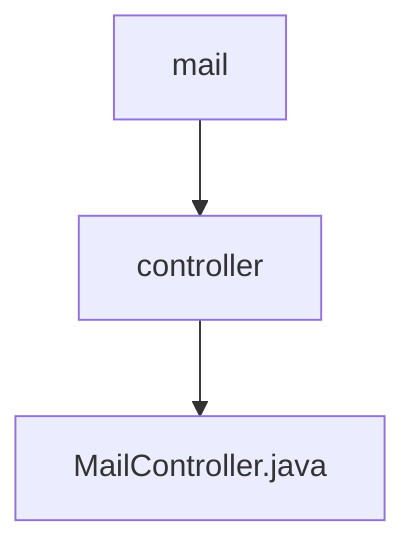

# 基础信息

|      |      |
|------|------|
| 名称 | controller |
| 编码语言 | .java |
| 代码路径 | staffjoy/mail-svc/src/main/java/xyz/staffjoy/mail/controller |
| 包名 | staffjoy.docs.mail-svc.src.main.java.xyz.staffjoy.mail.controller |
| 概述说明 | Java邮件发送控制器，异步处理请求并返回响应。 |

# 说明

这是一个名为MailController的Spring Boot REST控制器类，位于/v1路径下。该类使用@Validated注解启用参数校验，并自动装配了MailSendService服务。控制器包含一个POST方法/send，接收经过校验的EmailRequest请求体，异步调用mailSendService的sendMailAsync方法发送邮件，返回包含异步发送提示信息的BaseResponse响应对象。类中还定义了ILogger类型的日志记录器用于日志输出。

### 包内部结构视图

该流程图展示了mail-svc项目中邮件服务的简单层级结构。顶层是mail目录，其下包含controller子目录，controller目录中包含唯一的MailController.java文件。这种结构体现了典型的MVC模式，控制器层负责处理邮件相关的业务逻辑，整体结构简洁清晰。

# 文件列表 File List

| 名称   | 类型  | 说明 |
|-------|------|-------------|
| [MailController.java](MailController.md) | file | Java邮件发送控制器，异步处理请求并返回响应。 |

