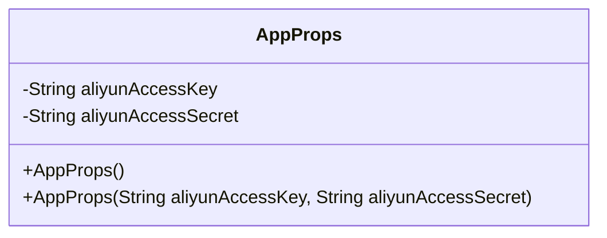
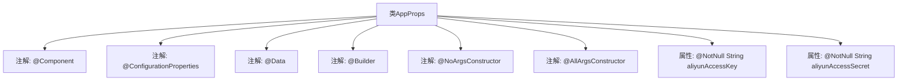

# 基础信息

|      |      |
|------|------|
| 名称 | AppProps |
| 编码语言 | .java |
| 代码路径 | staffjoy/mail-svc/src/main/java/xyz/staffjoy/mail/props/AppProps.java |
| 包名 | xyz.staffjoy.mail.props |
| 依赖项 | ['lombok.AllArgsConstructor', 'lombok.Builder', 'lombok.Data', 'lombok.NoArgsConstructor', 'org.springframework.boot.context.properties.ConfigurationProperties', 'org.springframework.stereotype.Component', 'javax.validation.constraints.NotNull'] |
| 概述说明 | Java配置类，含阿里云邮件密钥参数。 |

# 说明

这是一个名为AppProps的Java类，使用了Lombok注解简化代码。类上标注了@Component和@ConfigurationProperties注解，表明这是一个Spring组件，并会绑定以"staffjoy"为前缀的配置属性。类中包含两个非空的字符串属性aliyunAccessKey和aliyunAccessSecret，用于存储阿里云直邮服务的访问密钥和密钥。类使用了@Data、@Builder、@NoArgsConstructor和@AllArgsConstructor注解，自动生成getter/setter、构建器模式以及无参和全参构造函数。

# 类列表 Class Summary

| 名称   | 类型  | 说明 |
|-------|------|-------------|
| AppProps | class | Java配置类，包含阿里云邮件服务的密钥信息。 |

## 类 AppProps

|      |      |
|------|------|
| 访问范围 | @Component;@ConfigurationProperties(prefix="staffjoy");@Data;@Builder;@NoArgsConstructor;@AllArgsConstructor;public |
| 类型 | class |
| 名称 | AppProps |
| 说明 | Java配置类，包含阿里云邮件服务的密钥信息。 |

### UML类图

该代码定义了一个名为AppProps的配置类，使用Lombok注解自动生成构造函数、getter/setter等方法。类中包含两个非空字符串属性aliyunAccessKey和aliyunAccessSecret，用于存储阿里云邮件服务的访问凭证。通过@ConfigurationProperties注解绑定配置文件中的staffjoy前缀属性，适用于Spring Boot应用的配置管理场景。

### 内部方法调用关系图

这段代码定义了一个Spring Boot配置类AppProps，使用Lombok注解自动生成getter/setter、构造方法和建造者模式。类通过@ConfigurationProperties绑定"staffjoy"前缀的配置，包含两个阿里云邮件服务必需的密钥字段（aliyunAccessKey和aliyunAccessSecret），并强制非空校验。流程图清晰展示了类结构、注解层级和属性关系，体现了配置类与外部属性的映射机制。

### 字段列表 Field List

| 名称  | 类型  | 说明 |
|-------|-------|------|
| aliyunAccessKey | String | 非空阿里云访问密钥 |
| aliyunAccessSecret | String | 非空阿里云访问密钥 |

### 方法列表 Method List

| 名称  | 类型  | 说明 |
|-------|-------|------|

