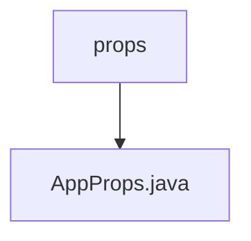

# 基础信息

|      |      |
|------|------|
| 名称 | props |
| 编码语言 | .java |
| 代码路径 | staffjoy/mail-svc/src/main/java/xyz/staffjoy/mail/props |
| 包名 | staffjoy.docs.mail-svc.src.main.java.xyz.staffjoy.mail.props |
| 概述说明 | Java配置类，含阿里云邮件密钥参数。 |

# 说明

这是一个名为AppProps的Java类，使用了Lombok注解简化代码。类上标注了@Component和@ConfigurationProperties注解，表明这是一个Spring组件，并会绑定以"staffjoy"为前缀的配置属性。类中包含两个非空的字符串属性aliyunAccessKey和aliyunAccessSecret，用于存储阿里云直邮服务的访问密钥和密钥。类使用了@Data、@Builder、@NoArgsConstructor和@AllArgsConstructor注解，自动生成getter/setter、构建器模式以及无参和全参构造函数。

### 包内部结构视图

该流程图展示了mail-svc项目中props目录与AppProps.java文件之间的层级关系。props作为父目录包含AppProps.java这一配置文件，体现了Java项目中典型的配置管理结构，这种简洁的层级关系有助于维护和定位配置文件。

# 文件列表 File List

| 名称   | 类型  | 说明 |
|-------|------|-------------|
| [AppProps.java](AppProps.md) | file | Java配置类，含阿里云邮件密钥参数。 |

