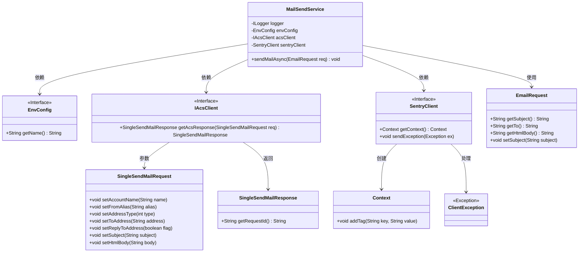
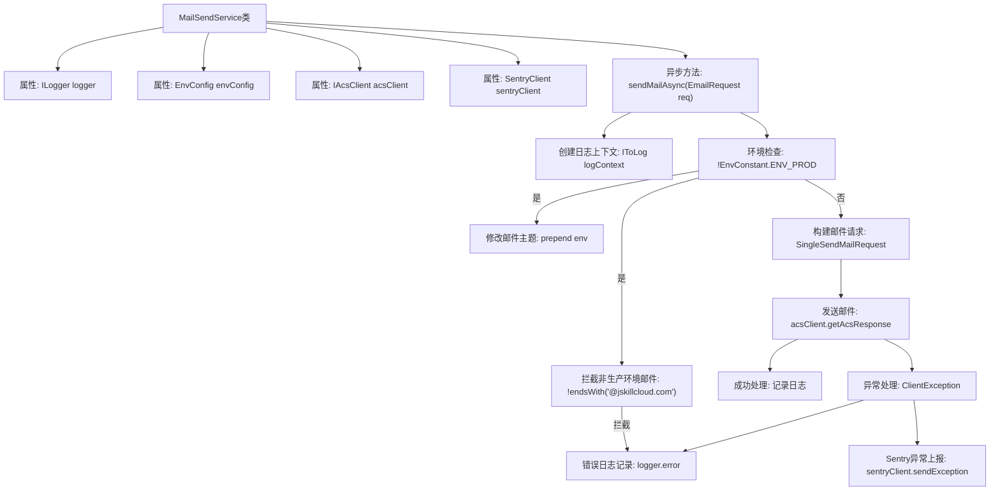

# 基础信息

|      |      |
|------|------|
| 名称 | MailSendService |
| 编码语言 | .java |
| 代码路径 | staffjoy/mail-svc/src/main/java/xyz/staffjoy/mail/service/MailSendService.java |
| 包名 | xyz.staffjoy.mail.service |
| 依赖项 | ['com.aliyuncs.IAcsClient', 'com.aliyuncs.dm.model.v20151123.SingleSendMailRequest', 'com.aliyuncs.dm.model.v20151123.SingleSendMailResponse', 'com.aliyuncs.exceptions.ClientException', 'com.github.structlog4j.ILogger', 'com.github.structlog4j.IToLog', 'com.github.structlog4j.SLoggerFactory', 'io.sentry.SentryClient', 'io.sentry.context.Context', 'org.springframework.beans.factory.annotation.Autowired', 'org.springframework.scheduling.annotation.Async', 'org.springframework.stereotype.Service', 'xyz.staffjoy.common.env.EnvConfig', 'xyz.staffjoy.common.env.EnvConstant', 'xyz.staffjoy.mail.MailConstant', 'xyz.staffjoy.mail.config.AppConfig', 'xyz.staffjoy.mail.dto.EmailRequest'] |
| 概述说明 | 邮件发送服务类，支持异步发送，非生产环境仅限内部邮箱，记录日志和异常。 |

# 说明

MailSendService是一个异步邮件发送服务类，使用@Async注解实现异步处理。它通过IAcsClient调用阿里云邮件服务API发送邮件。在非生产环境（dev/uat）中会拦截非jskillcloud.com后缀的收件地址，并自动在邮件主题前添加环境标识。发送过程会记录详细日志，包括邮件主题、收件人和HTML内容。若发送失败，会将异常信息上报至Sentry监控系统并记录错误日志。服务依赖EnvConfig获取环境配置，使用SentryClient进行异常监控。

# 类列表 Class Summary

| 名称   | 类型  | 说明 |
|-------|------|-------------|
| MailSendService | class | 邮件发送服务类，支持异步发送，非生产环境仅限特定域名，含日志和异常处理。 |

## 类 MailSendService

|      |      |
|------|------|
| 访问范围 | @Service;public |
| 类型 | class |
| 名称 | MailSendService |
| 说明 | 邮件发送服务类，支持异步发送，非生产环境仅限特定域名，含日志和异常处理。 |

### UML类图

这段代码展示了一个邮件发送服务类MailSendService，它通过异步方式发送邮件。该类依赖EnvConfig获取环境配置，使用IAcsClient与邮件服务API交互，并通过SentryClient记录异常。核心方法sendMailAsync会校验非生产环境只允许发送到特定域名，构造邮件请求对象后调用阿里云邮件服务，成功时记录日志，失败时通过Sentry上报异常。整个设计体现了环境隔离、异步处理和错误监控等关键特性。

### 内部方法调用关系图

这段流程图展示了MailSendService类的核心邮件发送流程。首先初始化日志上下文，然后进行环境检查，非生产环境会修改主题并拦截非公司域名的邮件。正常流程会构建邮件请求并通过阿里云客户端发送，成功则记录日志，失败则通过Sentry上报异常并记录错误日志。整个过程采用异步执行方式，关键步骤都包含完善的日志记录和异常处理机制。

### 字段列表 Field List

| 名称  | 类型  | 说明 |
|-------|-------|------|
| envConfig | EnvConfig | 自动注入EnvConfig配置实例 |
| acsClient | IAcsClient | 自动注入阿里云客户端实例 |
| logger = SLoggerFactory.getLogger(MailSendService.class) | ILogger | 私有日志记录器，用于邮件发送服务类。 |
| sentryClient | SentryClient | 自动注入SentryClient实例。 |

### 方法列表 Method List

| 名称  | 类型  | 说明 |
|-------|-------|------|
| sendMailAsync | void | 异步发送邮件，非生产环境仅限特定域名，记录日志和异常。 |

