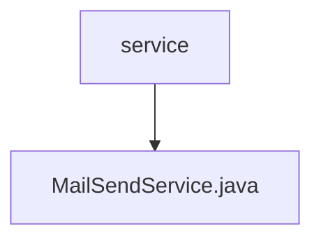

# 基础信息

|      |      |
|------|------|
| 名称 | service |
| 编码语言 | .java |
| 代码路径 | staffjoy/mail-svc/src/main/java/xyz/staffjoy/mail/service |
| 包名 | staffjoy.docs.mail-svc.src.main.java.xyz.staffjoy.mail.service |
| 概述说明 | 邮件发送服务类，支持异步发送，非生产环境仅限内部邮箱，记录日志和异常。 |

# 说明

MailSendService是一个异步邮件发送服务类，使用@Async注解实现异步处理。它通过IAcsClient调用阿里云邮件服务API发送邮件。在非生产环境（dev/uat）中会拦截非jskillcloud.com后缀的收件地址，并自动在邮件主题前添加环境标识。发送过程会记录详细日志，包括邮件主题、收件人和HTML内容。若发送失败，会将异常信息上报至Sentry监控系统并记录错误日志。服务依赖EnvConfig获取环境配置，使用SentryClient进行异常监控。

### 包内部结构视图

该流程图展示了mail-svc项目中mail模块的服务层结构。顶层节点为service目录，其下包含一个具体的服务实现文件MailSendService.java。这是一个简单的层级关系，体现了服务层中邮件发送服务的单一实现，符合微服务架构中单一职责原则的设计理念。

# 文件列表 File List

| 名称   | 类型  | 说明 |
|-------|------|-------------|
| [MailSendService.java](MailSendService.md) | file | 邮件发送服务类，支持异步发送，非生产环境仅限内部邮箱，记录日志和异常。 |

