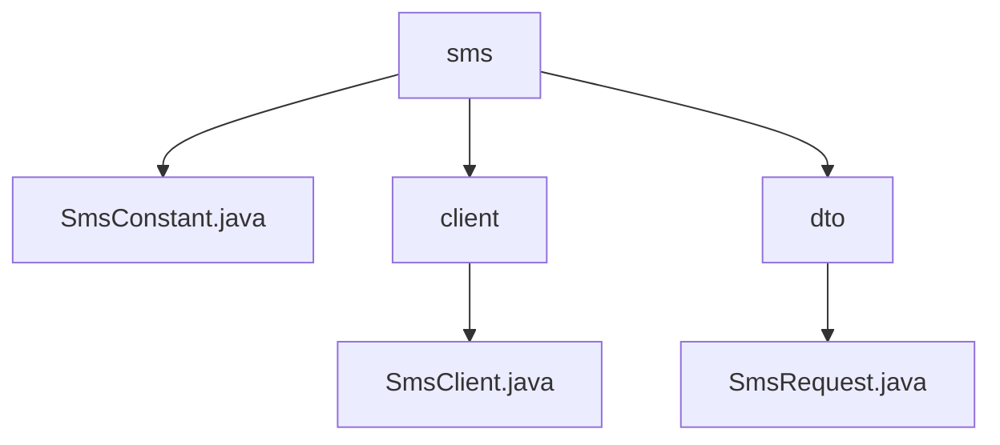

# 基础信息

|      |      |
|------|------|
| 名称 | xyz |
| 编码语言 | .java |
| 代码路径 | staffjoy/sms-api/src/main/java/xyz |
| 包名 | staffjoy.docs.sms-api.src.main.java.xyz |
| 概述说明 | Spring Cloud Feign客户端接口，用于短信服务调用，包含请求类、常量配置和发送方法。 |

# 说明

# 短信服务API模块总结

## 概述
该代码模块是一个基于Spring Cloud Feign实现的短信服务API客户端，主要用于封装短信发送功能。模块通过定义清晰的请求数据结构、服务端常量配置和HTTP客户端接口，为系统提供了标准化的短信服务调用能力。模块采用阿里云短信服务作为底层实现，通过配置化的方式管理服务参数，并提供了数据校验和便捷的对象构建功能。

## 主要业务场景
1. **短信发送**：通过Feign客户端调用远程短信服务，将验证短信、通知短信等内容发送给指定手机号码
2. **模板短信处理**：支持基于模板的短信发送，可以动态传入模板参数进行内容填充
3. **服务集成**：为其他微服务提供标准化的短信服务接入方式，通过简单的API调用即可完成短信功能
4. **参数校验**：在请求数据层面自动校验手机号、模板代码等必填字段，确保请求有效性
5. **配置管理**：集中管理短信服务相关的各种配置参数，包括服务名称、区域端点、队列容量等

### 包内部结构视图

该流程图展示了sms-api模块的核心结构，包含三个主要节点：SmsConstant.java常量类、client客户端包和dto数据传输对象包。client下包含SmsClient.java客户端实现，dto下包含SmsRequest.java请求对象，整体呈现清晰的层级关系，反映了短信服务API的基础代码组织方式。

# 文件列表 File List

| 名称   | 类型  | 说明 |
|-------|------|-------------|
| [staffjoy](staffjoy/_module.md) | package | Spring Cloud Feign客户端接口，用于短信服务调用，包含请求类、常量配置和发送方法。 |

