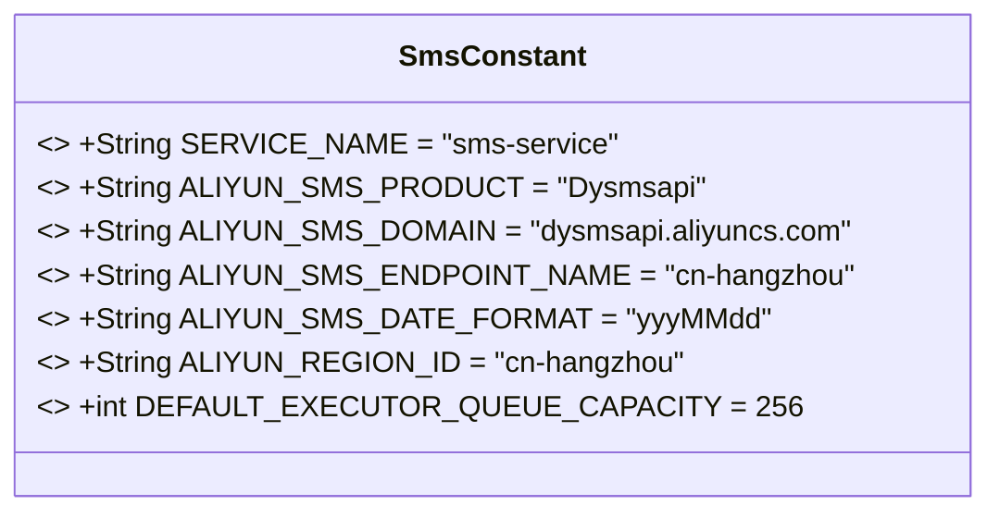
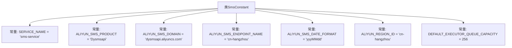

# 基础信息

|      |      |
|------|------|
| 名称 | SmsConstant |
| 编码语言 | .java |
| 代码路径 | staffjoy/sms-api/src/main/java/xyz/staffjoy/sms/SmsConstant.java |
| 包名 | xyz.staffjoy.sms |
| 依赖项 | [] |
| 概述说明 | 短信服务常量类，含阿里云短信配置及默认队列容量256。 |

# 说明

该代码定义了一个名为SmsConstant的公共类，包含多个静态常量字段。这些常量用于配置短信服务相关参数，包括服务名称sms-service、阿里云短信产品名称Dysmsapi、域名dysmsapi.aliyuncs.com、杭州区域端点名称cn-hangzhou、日期格式yyyMMdd、杭州区域ID cn-hangzhou，以及默认执行队列容量256。这些配置参数为短信服务提供了基础设置。

# 类列表 Class Summary

| 名称   | 类型  | 说明 |
|-------|------|-------------|
| SmsConstant | class | 短信服务常量类，包含阿里云短信配置及默认队列容量256。 |

## 类 SmsConstant

|      |      |
|------|------|
| 访问范围 | public |
| 类型 | class |
| 名称 | SmsConstant |
| 说明 | 短信服务常量类，包含阿里云短信配置及默认队列容量256。 |

### UML类图

这段代码定义了一个名为SmsConstant的常量类，其中包含了7个静态不可变字段，主要用于配置阿里云短信服务的相关参数。这些常量包括服务名称、产品标识、域名、区域端点、日期格式、区域ID以及默认线程队列容量。该类作为配置中心，为短信服务模块提供统一且不可修改的配置值，确保系统各组件能获取一致的参数设置。所有字段均为public static final类型，符合常量类的最佳实践。

### 内部方法调用关系图

这段代码定义了一个名为SmsConstant的类，其中包含了多个静态常量字段，主要用于配置阿里云短信服务的相关参数。这些常量包括服务名称、产品名称、域名、端点名称、日期格式、区域ID以及默认执行队列容量等。这些常量在整个项目中可以被直接引用，避免了硬编码，提高了代码的可维护性和可读性。

### 字段列表 Field List

| 名称  | 类型  | 说明 |
|-------|-------|------|
| ALIYUN_SMS_DOMAIN = "dysmsapi.aliyuncs.com" | String | 阿里云短信服务域名常量 |
| ALIYUN_SMS_DATE_FORMAT = "yyyMMdd" | String | 阿里云短信日期格式常量定义为yyyMMdd。 |
| ALIYUN_SMS_PRODUCT = "Dysmsapi" | String | 阿里云短信产品标识为Dysmsapi |
| ALIYUN_SMS_ENDPOINT_NAME = "cn-hangzhou" | String | 阿里云短信服务端点设为杭州区域 |
| SERVICE_NAME = "sms-service" | String | 短信服务常量定义 |
| ALIYUN_REGION_ID = "cn-hangzhou" | String | 阿里云区域ID设为杭州 |
| DEFAULT_EXECUTOR_QUEUE_CAPACITY = 256 | int | 默认执行队列容量256 |

### 方法列表 Method List

| 名称  | 类型  | 说明 |
|-------|-------|------|

