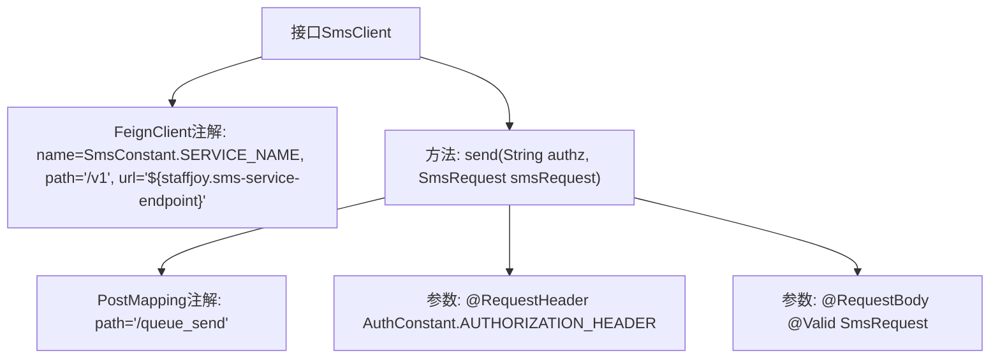

# 基础信息

|      |      |
|------|------|
| 名称 | SmsClient |
| 编码语言 | .java |
| 代码路径 | staffjoy/sms-api/src/main/java/xyz/staffjoy/sms/client/SmsClient.java |
| 包名 | xyz.staffjoy.sms.client |
| 依赖项 | ['org.springframework.cloud.openfeign.FeignClient', 'org.springframework.web.bind.annotation.PostMapping', 'org.springframework.web.bind.annotation.RequestBody', 'org.springframework.web.bind.annotation.RequestHeader', 'xyz.staffjoy.common.api.BaseResponse', 'xyz.staffjoy.common.auth.AuthConstant', 'xyz.staffjoy.sms.SmsConstant', 'xyz.staffjoy.sms.dto.SmsRequest', 'javax.validation.Valid'] |
| 概述说明 | Feign客户端接口，调用短信服务发送消息。 |

# 说明

这是一个使用Spring Cloud Feign的HTTP客户端接口定义，用于短信服务调用。该接口通过@FeignClient注解指定了服务名称为SmsConstant.SERVICE_NAME，基础路径为/v1，并通过配置项staffjoy.sms-service-endpoint获取服务端点地址。接口中定义了一个POST方法queue_send，需要传入Authorization请求头和经过验证的SmsRequest请求体，返回BaseResponse类型响应。该客户端主要用于发送短信请求。

# 类列表 Class Summary

| 名称   | 类型  | 说明 |
|-------|------|-------------|
| SmsClient | interface | Feign客户端接口，调用短信服务发送短信API。 |


## 类 SmsClient

|      |      |
|------|------|
| 访问范围 | @FeignClient(name = SmsConstant.SERVICE_NAME, path = "/v1", url = "${staffjoy.sms-service-endpoint}");public |
| 类型 | interface |
| 名称 | SmsClient |
| 说明 | Feign客户端接口，调用短信服务发送短信API。 |


### UML类图

```mermaid
classDiagram
    class SmsClient {
        <<Interface>>
        +send(String authz, SmsRequest smsRequest) BaseResponse
    }
    SmsClient ..|> FeignClient : 实现

    class FeignClient {
        <<Interface>>
    }
    // FeignClient是Spring Cloud的声明式HTTP客户端接口
    // SmsClient通过@FeignClient注解实现远程服务调用

    class BaseResponse {
        // 基础响应类，包含响应状态等信息
    }

    class SmsRequest {
        // 短信请求参数封装类
    }

    class AuthConstant {
        <<Constant>>
        // 认证相关常量定义
    }

    class SmsConstant {
        <<Constant>>
        // 短信服务相关常量定义
    }

    SmsClient --> BaseResponse : 返回
    SmsClient --> SmsRequest : 使用
    SmsClient --> AuthConstant : 引用
    SmsClient --> SmsConstant : 引用
```

这段代码描述了一个基于Spring Cloud Feign的短信服务客户端接口。SmsClient接口通过@FeignClient注解声明为远程HTTP客户端，指定了服务名称(SmsConstant.SERVICE_NAME)、基础路径(/v1)和服务端点URL。该接口定义了send方法用于发送短信，需要传入认证头信息(AuthConstant.AUTHORIZATION_HEADER)和验证过的短信请求体(@Valid SmsRequest)，返回BaseResponse类型响应。整个设计遵循了微服务间通信的常见模式，通过注解简化了远程调用实现。


### 内部方法调用关系图



这段代码定义了一个Feign客户端接口SmsClient，用于发送短信请求。该接口通过@FeignClient注解配置了服务名称、基础路径和服务端点URL。其中包含一个send方法，使用@PostMapping指定了"/queue_send"路径，方法接收授权头信息和经过验证的短信请求体作为参数。流程图清晰地展示了接口结构、注解配置和方法参数之间的层级关系，体现了Feign客户端的基本组成要素。

### 字段列表 Field List

| 名称  | 类型  | 说明 |
|-------|-------|------|

### 方法列表 Method List

| 名称  | 类型  | 说明 |
|-------|-------|------|
| send | BaseResponse | 接口定义：POST请求/queue_send，需认证头，接收短信请求体。 |


