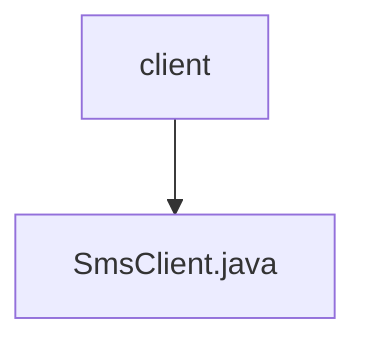

# 基础信息

|      |      |
|------|------|
| 名称 | client |
| 编码语言 | .java |
| 代码路径 | staffjoy/sms-api/src/main/java/xyz/staffjoy/sms/client |
| 包名 | staffjoy.docs.sms-api.src.main.java.xyz.staffjoy.sms.client |
| 概述说明 | Feign客户端接口，调用短信服务发送消息。 |

# 说明

这是一个使用Spring Cloud Feign的HTTP客户端接口定义，用于短信服务调用。该接口通过@FeignClient注解指定了服务名称为SmsConstant.SERVICE_NAME，基础路径为/v1，并通过配置项staffjoy.sms-service-endpoint获取服务端点地址。接口中定义了一个POST方法queue_send，需要传入Authorization请求头和经过验证的SmsRequest请求体，返回BaseResponse类型响应。该客户端主要用于发送短信请求。

### 包内部结构视图

该流程图展示了sms-api项目中client目录与SmsClient.java文件的层级关系。client作为父节点，包含一个子节点SmsClient.java，表示这是一个简单的客户端接口文件与其所在目录的从属关系。整个结构清晰地呈现了Java项目中典型的包与类文件的组织方式。

# 文件列表 File List

| 名称   | 类型  | 说明 |
|-------|------|-------------|
| [SmsClient.java](SmsClient.md) | file | Feign客户端接口，调用短信服务发送消息。 |

