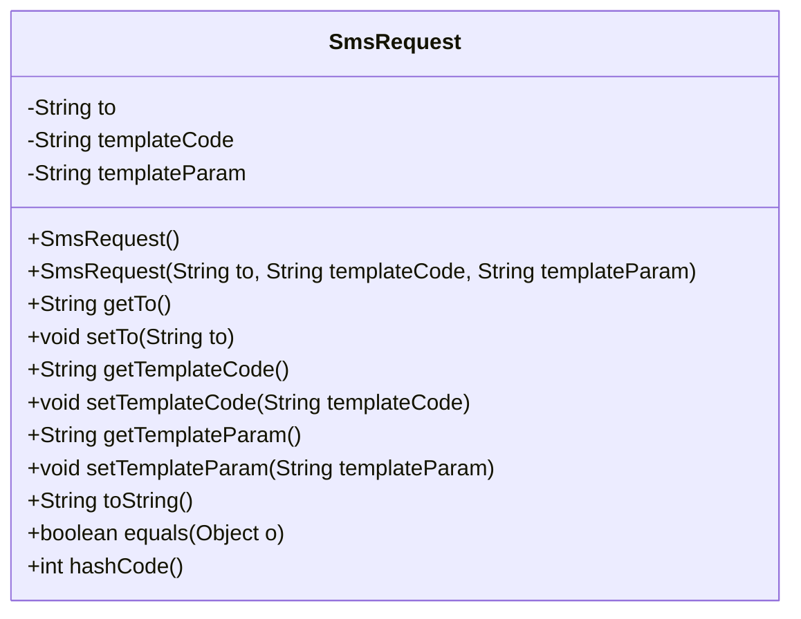
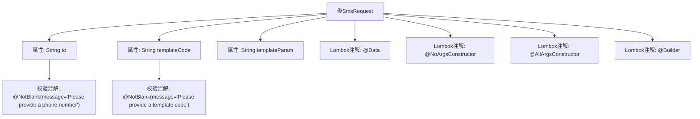

# 基础信息

|      |      |
|------|------|
| 名称 | SmsRequest |
| 编码语言 | .java |
| 代码路径 | staffjoy/sms-api/src/main/java/xyz/staffjoy/sms/dto/SmsRequest.java |
| 包名 | xyz.staffjoy.sms.dto |
| 依赖项 | ['lombok.AllArgsConstructor', 'lombok.Builder', 'lombok.Data', 'lombok.NoArgsConstructor', 'javax.validation.constraints.NotBlank'] |
| 概述说明 | 短信请求类，包含接收号码、模板代码和参数。 |

# 说明

这是一个名为SmsRequest的Java类定义，用于封装短信发送请求数据。类使用了Lombok注解自动生成无参构造器、全参构造器和建造者模式。包含三个字段：to字段表示接收方手机号，使用@NotBlank注解确保非空并附带提示信息；templateCode字段表示短信模板代码，同样要求非空；templateParam字段表示模板参数，允许为空。整个类结构简洁，通过注解实现了数据校验和对象构建功能。

# 类列表 Class Summary

| 名称   | 类型  | 说明 |
|-------|------|-------------|
| SmsRequest | class | 短信请求类，含接收号码、模板代码和参数，支持构造和验证。 |

## 类 SmsRequest

|      |      |
|------|------|
| 访问范围 | @Data;@NoArgsConstructor;@AllArgsConstructor;@Builder;public |
| 类型 | class |
| 名称 | SmsRequest |
| 说明 | 短信请求类，含接收号码、模板代码和参数，支持构造和验证。 |

### UML类图

该代码定义了一个SmsRequest类，使用Lombok注解自动生成构造器、getter/setter、toString等方法。类包含三个核心字段：接收方手机号(to)、短信模板代码(templateCode)和模板参数(templateParam)，其中前两个字段通过@NotBlank注解强制非空校验。通过@Builder支持建造者模式，@AllArgsConstructor和@NoArgsConstructor分别生成全参和无参构造器，整体设计用于规范短信发送请求的数据结构。

### 内部方法调用关系图

该流程图描述了SmsRequest类的结构，这是一个使用Lombok注解简化开发的POJO类。类包含三个核心属性：to（接收方手机号）、templateCode（模板代码）和templateParam（模板参数），其中前两个属性通过@NotBlank注解强制非空校验。通过@Data自动生成getter/setter，@Builder提供建造者模式，@NoArgsConstructor和@AllArgsConstructor分别生成无参和全参构造器。整体设计简洁，适用于短信请求参数的封装与校验场景。

### 字段列表 Field List

| 名称  | 类型  | 说明 |
|-------|-------|------|
| to | String | 非空校验电话号码字段 |
| templateCode | String | 非空模板代码字段 |
| templateParam | String | 私有字符串变量templateParam。 |

### 方法列表 Method List

| 名称  | 类型  | 说明 |
|-------|-------|------|

