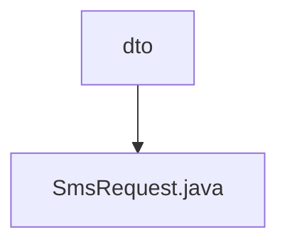

# 基础信息

|      |      |
|------|------|
| 名称 | dto |
| 编码语言 | .java |
| 代码路径 | staffjoy/sms-api/src/main/java/xyz/staffjoy/sms/dto |
| 包名 | staffjoy.docs.sms-api.src.main.java.xyz.staffjoy.sms.dto |
| 概述说明 | 短信请求类，包含接收号码、模板代码和参数。 |

# 说明

这是一个名为SmsRequest的Java类定义，用于封装短信发送请求数据。类使用了Lombok注解自动生成无参构造器、全参构造器和建造者模式。包含三个字段：to字段表示接收方手机号，使用@NotBlank注解确保非空并附带提示信息；templateCode字段表示短信模板代码，同样要求非空；templateParam字段表示模板参数，允许为空。整个类结构简洁，通过注解实现了数据校验和对象构建功能。

### 包内部结构视图

该流程图展示了sms-api项目中dto目录下的文件结构。顶层节点为dto目录，其下包含一个SmsRequest.java文件。这个简单的层级关系清晰地呈现了该模块中数据传输对象的结构，符合Java项目常见的DTO模式设计。

# 文件列表 File List

| 名称   | 类型  | 说明 |
|-------|------|-------------|
| [SmsRequest.java](SmsRequest.md) | file | 短信请求类，包含接收号码、模板代码和参数。 |

