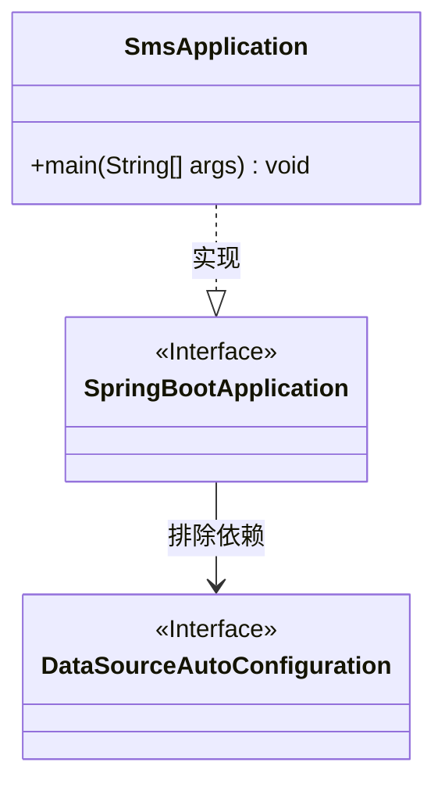
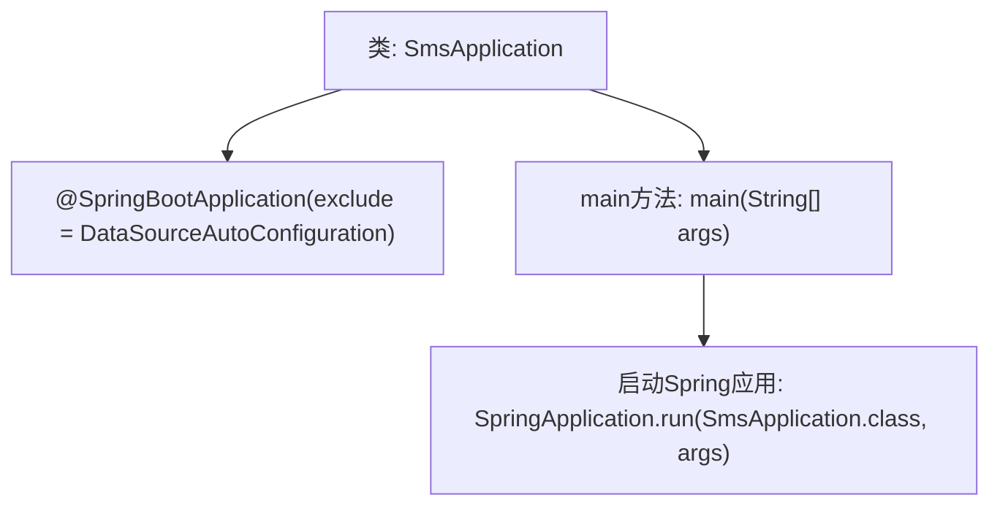

# 基础信息

|      |      |
|------|------|
| 名称 | SmsApplication |
| 编码语言 | .java |
| 代码路径 | staffjoy/sms-svc/src/main/java/xyz/staffjoy/sms/SmsApplication.java |
| 包名 | xyz.staffjoy.sms |
| 依赖项 | ['org.springframework.boot.SpringApplication', 'org.springframework.boot.autoconfigure.SpringBootApplication', 'org.springframework.boot.autoconfigure.jdbc.DataSourceAutoConfiguration'] |
| 概述说明 | SpringBoot应用排除数据源配置，主类启动。 |

# 说明

这是一个Spring Boot应用的主启动类，使用@SpringBootApplication注解标记，并排除了DataSourceAutoConfiguration自动配置。类名为SmsApplication，包含标准的main方法作为程序入口，通过SpringApplication.run启动应用。该配置表明这是一个不需要数据源的独立应用。

# 类列表 Class Summary

| 名称   | 类型  | 说明 |
|-------|------|-------------|
| SmsApplication | class | SpringBoot应用排除数据源配置，启动SmsApplication。 |

## 类 SmsApplication

|      |      |
|------|------|
| 访问范围 | @SpringBootApplication(exclude = {DataSourceAutoConfiguration.class});public |
| 类型 | class |
| 名称 | SmsApplication |
| 说明 | SpringBoot应用排除数据源配置，启动SmsApplication。 |

### UML类图

类图描述：该图展示了Spring Boot应用的启动类结构。SmsApplication类通过@SpringBootApplication注解实现SpringBootApplication接口，并显式排除了DataSourceAutoConfiguration的自动配置。main方法作为入口点启动应用，体现了Spring Boot的约定优于配置原则，同时展示了如何通过注解参数控制自动配置行为。

### 内部方法调用关系图

这段代码是一个典型的Spring Boot应用启动类，使用@SpringBootApplication注解标记主类，并通过exclude参数排除了数据源自动配置。main方法中调用SpringApplication.run()启动应用，该流程展示了Spring Boot应用的初始化入口。注解配置和启动方法构成了核心逻辑，省略了数据源相关配置表明可能是一个无持久层需求的轻量级服务（如短信服务）。

### 字段列表 Field List

| 名称  | 类型  | 说明 |
|-------|-------|------|

### 方法列表 Method List

| 名称  | 类型  | 说明 |
|-------|-------|------|
| main | void | Java启动Spring应用的main方法。 |

