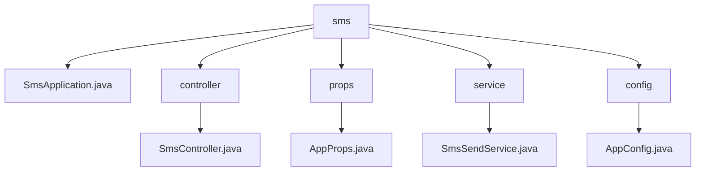

# 基础信息

|      |      |
|------|------|
| 名称 | sms |
| 编码语言 | .java |
| 代码路径 | staffjoy/sms-svc/src/main/java/xyz/staffjoy/sms |
| 包名 | staffjoy.docs.sms-svc.src.main.java.xyz.staffjoy.sms |
| 概述说明 | Spring Boot短信服务应用，含主启动类、短信发送控制器、阿里云配置属性和异步发送服务，支持白名单验证和日志记录。 |

# 说明

# 短信服务模块总结

## 概述

这是一个基于Spring Boot构建的短信发送服务模块，主要功能是通过阿里云短信服务实现短信的异步发送。该模块设计为独立服务，不需要数据库支持，通过排除DataSourceAutoConfiguration自动配置实现。核心功能包括短信发送请求处理、白名单验证、异步发送短信以及与阿里云短信服务的集成。

## 主要业务场景

1. **短信发送处理**：
   - 提供RESTful接口`/v1/queue_send`接收短信发送请求
   - 需要公司、账户或机器人服务授权才能调用
   - 支持异步处理短信发送请求，提高系统吞吐量

2. **白名单控制**：
   - 可配置白名单开关(whiteListOnly)
   - 当白名单启用时，只允许发送给白名单中的电话号码
   - 白名单电话号码可配置(whiteListPhoneNumbers)

3. **阿里云短信服务集成**：
   - 使用阿里云SDK(IAcsClient)实现短信发送
   - 配置阿里云访问密钥(accessKey/secret)和短信签名
   - 处理阿里云服务调用异常并记录

4. **系统配置**：
   - 可配置并发处理线程数(concurrency)
   - 提供阿里云客户端和异步执行器的Spring Bean配置
   - 集成Sentry进行错误监控和日志记录

### 包内部结构视图

该流程图展示了短信服务(sms)模块的层级结构，根目录包含主应用文件、控制器、属性配置、服务和配置子目录。控制器目录下包含短信控制器，属性目录包含应用属性文件，服务目录包含短信发送服务，配置目录包含应用配置文件。整个结构清晰地反映了短信服务模块的代码组织方式。

# 文件列表 File List

| 名称   | 类型  | 说明 |
|-------|------|-------------|
| [SmsApplication.java](SmsApplication.md) | file | SpringBoot应用排除数据源配置，主类启动。 |
| [config](config/_module.md) | package | 配置类启用异步，导入依赖，定义异步执行器和阿里云客户端。 |
| [service](service/_module.md) | package | 短信服务类，异步发送短信，记录日志和异常。 |
| [props](props/_module.md) | package | Java配置类AppProps，包含阿里云邮件和短信配置、白名单开关及并发数设置。 |
| [controller](controller/_module.md) | package | 短信发送控制器，支持白名单校验和异步发送。 |

