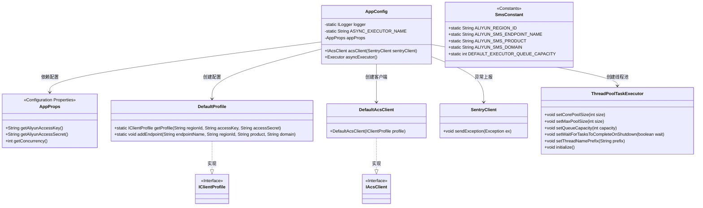
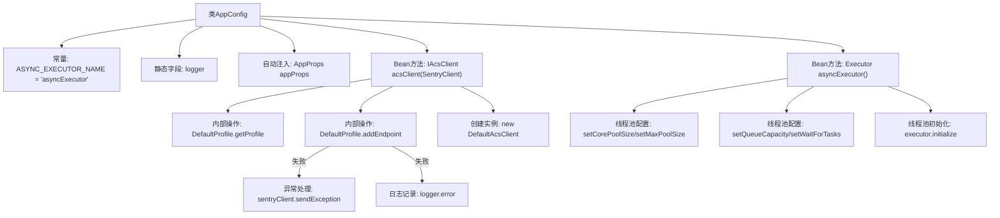

# 基础信息

|      |      |
|------|------|
| 名称 | AppConfig |
| 编码语言 | .java |
| 代码路径 | staffjoy/sms-svc/src/main/java/xyz/staffjoy/sms/config/AppConfig.java |
| 包名 | xyz.staffjoy.sms.config |
| 依赖项 | ['com.aliyuncs.DefaultAcsClient', 'com.aliyuncs.IAcsClient', 'com.aliyuncs.exceptions.ClientException', 'com.aliyuncs.profile.DefaultProfile', 'com.aliyuncs.profile.IClientProfile', 'com.github.structlog4j.ILogger', 'com.github.structlog4j.SLoggerFactory', 'io.sentry.SentryClient', 'org.springframework.context.annotation.Import', 'org.springframework.scheduling.annotation.EnableAsync', 'org.springframework.scheduling.concurrent.ThreadPoolTaskExecutor', 'xyz.staffjoy.common.config.StaffjoyRestConfig', 'xyz.staffjoy.sms.SmsConstant', 'xyz.staffjoy.sms.props.AppProps', 'org.springframework.beans.factory.annotation.Autowired', 'org.springframework.context.annotation.Bean', 'org.springframework.context.annotation.Configuration', 'java.util.concurrent.Executor'] |
| 概述说明 | 配置类启用异步，导入依赖，定义异步执行器和阿里云客户端。 |

# 说明

这是一个名为AppConfig的Java配置类，启用了异步功能并导入了StaffjoyRestConfig。类中定义了一个名为asyncExecutor的常量字符串ASYNC_EXECUTOR_NAME。配置类包含两个Bean定义：一个是创建阿里云短信服务客户端acsClient，使用阿里云访问密钥和区域配置，异常时会记录日志并发送到Sentry；另一个是创建异步任务执行器asyncExecutor，其线程池大小由应用属性配置，队列容量使用默认值，线程名前缀为AsyncThread-，并设置了任务完成后再关闭的特性。

# 类列表 Class Summary

| 名称   | 类型  | 说明 |
|-------|------|-------------|
| AppConfig | class | 配置类启用异步，定义阿里云客户端和线程池执行器。 |

## 类 AppConfig

|      |      |
|------|------|
| 访问范围 | @Configuration;@EnableAsync;@Import(value = StaffjoyRestConfig.class);public |
| 类型 | class |
| 名称 | AppConfig |
| 说明 | 配置类启用异步，定义阿里云客户端和线程池执行器。 |

### UML类图

这段代码是一个Spring配置类，主要完成阿里云短信客户端(IAcsClient)和异步线程池的初始化配置。通过@Autowired注入应用配置AppProps，使用DefaultProfile创建阿里云客户端配置，并处理可能的异常。同时配置了ThreadPoolTaskExecutor作为异步任务执行器，设置核心参数如并发数、队列容量等。类图展示了配置类与阿里云SDK组件、线程池及监控组件的交互关系。

### 内部方法调用关系图

这段代码是Spring配置类AppConfig，主要功能是创建阿里云短信客户端和异步线程池。流程图展示了类结构、依赖注入关系和两个核心Bean的创建过程：acsClient方法会配置阿里云客户端并处理可能的异常，asyncExecutor方法则配置线程池参数并初始化。异常处理路径通过Sentry上报错误并记录日志，体现了健壮的错误处理机制。整个配置类通过注解实现Spring容器的集成，为应用提供关键基础设施组件。

### 字段列表 Field List

| 名称  | 类型  | 说明 |
|-------|-------|------|
| appProps | AppProps | 自动注入AppProps配置属性 |
| ASYNC_EXECUTOR_NAME = "asyncExecutor" | String | 异步执行器名称定义为asyncExecutor。 |
| logger = SLoggerFactory.getLogger(AppConfig.class) | ILogger | 私有静态日志记录器，通过工厂获取AppConfig类日志实例。 |

### 方法列表 Method List

| 名称  | 类型  | 说明 |
|-------|-------|------|
| asyncExecutor | Executor | 创建异步线程池，设置核心和最大线程数、队列容量、线程名前缀，支持任务完成关闭。 |
| acsClient | IAcsClient | 创建阿里云短信客户端，配置密钥和端点，异常时记录日志并上报。 |

