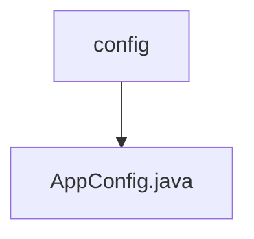

# 基础信息

|      |      |
|------|------|
| 名称 | config |
| 编码语言 | .java |
| 代码路径 | staffjoy/sms-svc/src/main/java/xyz/staffjoy/sms/config |
| 包名 | staffjoy.docs.sms-svc.src.main.java.xyz.staffjoy.sms.config |
| 概述说明 | 配置类启用异步，导入依赖，定义异步执行器和阿里云客户端。 |

# 说明

这是一个名为AppConfig的Java配置类，启用了异步功能并导入了StaffjoyRestConfig。类中定义了一个名为asyncExecutor的常量字符串ASYNC_EXECUTOR_NAME。配置类包含两个Bean定义：一个是创建阿里云短信服务客户端acsClient，使用阿里云访问密钥和区域配置，异常时会记录日志并发送到Sentry；另一个是创建异步任务执行器asyncExecutor，其线程池大小由应用属性配置，队列容量使用默认值，线程名前缀为AsyncThread-，并设置了任务完成后再关闭的特性。

### 包内部结构视图

该流程图展示了短信服务项目中配置文件的层级关系。顶层节点为config目录，其下包含一个具体的配置文件AppConfig.java。这种结构是典型的Spring Boot应用配置方式，其中AppConfig.java可能包含应用的基础配置信息。整个结构简洁明了，符合单一职责原则。

# 文件列表 File List

| 名称   | 类型  | 说明 |
|-------|------|-------------|
| [AppConfig.java](AppConfig.md) | file | 配置类启用异步，导入依赖，定义异步执行器和阿里云客户端。 |

