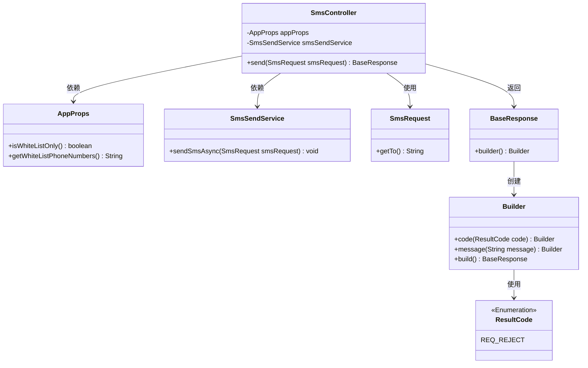
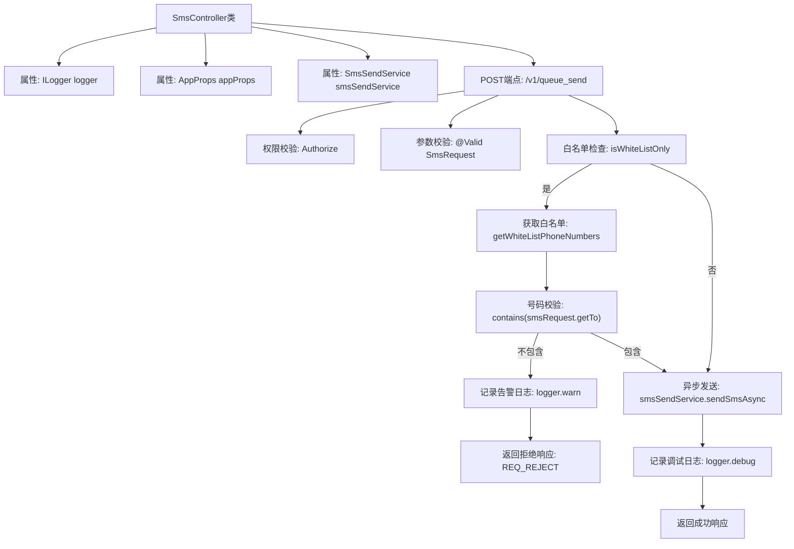

# 基础信息

|      |      |
|------|------|
| 名称 | SmsController |
| 编码语言 | .java |
| 代码路径 | staffjoy/sms-svc/src/main/java/xyz/staffjoy/sms/controller/SmsController.java |
| 包名 | xyz.staffjoy.sms.controller |
| 依赖项 | ['com.github.structlog4j.ILogger', 'com.github.structlog4j.SLoggerFactory', 'org.springframework.beans.factory.annotation.Autowired', 'org.springframework.util.StringUtils', 'org.springframework.validation.annotation.Validated', 'org.springframework.web.bind.annotation', 'xyz.staffjoy.common.api.BaseResponse', 'xyz.staffjoy.common.api.ResultCode', 'xyz.staffjoy.common.auth.AuthConstant', 'xyz.staffjoy.common.auth.Authorize', 'xyz.staffjoy.sms.props.AppProps', 'xyz.staffjoy.sms.dto.SmsRequest', 'xyz.staffjoy.sms.service.SmsSendService', 'javax.validation.Valid'] |
| 概述说明 | 短信发送控制器，支持白名单校验和异步发送。 |

# 说明

这是一个短信发送控制器类，使用Spring框架实现。它包含一个POST接口/v1/queue_send，需要公司、账户或机器人服务授权。该接口接收短信请求，首先检查白名单设置，若启用则验证接收号码是否在白名单内，否则拒绝请求。验证通过后异步发送短信，并返回操作结果。整个过程都有详细的日志记录。

# 类列表 Class Summary

| 名称   | 类型  | 说明 |
|-------|------|-------------|
| SmsController | class | 短信发送控制器，支持白名单校验和异步发送。 |

## 类 SmsController

|      |      |
|------|------|
| 访问范围 | @RestController;@RequestMapping("/v1");@Validated;public |
| 类型 | class |
| 名称 | SmsController |
| 说明 | 短信发送控制器，支持白名单校验和异步发送。 |

### UML类图

该类图展示了SmsController的核心结构和依赖关系。SmsController作为REST控制器，依赖AppProps读取白名单配置，依赖SmsSendService异步发送短信。处理请求时，会验证SmsRequest中的电话号码是否在白名单内，并通过Builder模式构造包含状态码(ResultCode)和消息的BaseResponse响应。整个流程体现了权限控制、参数校验、业务逻辑处理和异步操作等关键设计要素。

### 内部方法调用关系图

该流程图展示了短信发送控制器的完整处理流程。首先进行权限校验和参数验证，然后检查白名单模式是否启用。若启用则验证目标号码是否在白名单中，非法号码会触发告警并返回拒绝响应；合法号码或非白名单模式则进入异步发送流程，成功后记录调试日志并返回成功响应。流程包含完整的异常处理分支和日志记录节点，体现了生产级API的安全控制和可观测性设计。

### 字段列表 Field List

| 名称  | 类型  | 说明 |
|-------|-------|------|
| appProps | AppProps | 自动注入AppProps配置类实例。 |
| logger = SLoggerFactory.getLogger(SmsController.class) | ILogger | 静态日志记录器，用于SmsController类。 |
| smsSendService | SmsSendService | 自动注入短信发送服务实例。 |

### 方法列表 Method List

| 名称  | 类型  | 说明 |
|-------|-------|------|
| send | BaseResponse | 短信发送接口，支持白名单校验，异步发送。 |

